# 环境配置

> pymycobot是Elephant Robot开发的Python库，用于机器人控制。

## Linux

系统出厂时默认安装了Python 3.10.12，并且已经安装了`pymycobot`控制库，用户无需自行安装。

### pymycobot 安装

通过终端输入命令即可安装pymycobot
````bash
pip install pymycobot
````

### pymycobot 卸载

您可以通过终端输入命令来卸载pymycobot

````bash
pip uninstall pymycobot
````

### pymycobot 更新

您可以通过终端输入命令来更新pymycobot

````bash
pip install pymycobot -U
````

## 窗口

### 1.1 安装Python

> **注意：** 安装前，请检查PC的操作系统。 在“我的电脑”图标上按右键，然后选择“属性”。安装相应的Python。
>
> 
>
> 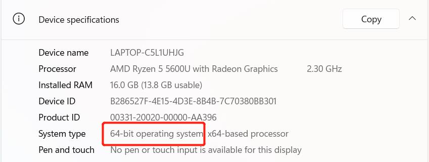

* **前往http://www.python.org/download/下载Python。**
* **点击“下载”，然后开始下载。 勾选“将 Python 3.10 添加到 PATH”。 单击“立即安装”，然后开始安装。**


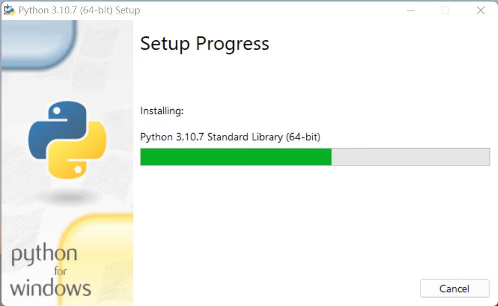

* **下载并安装完成。**
   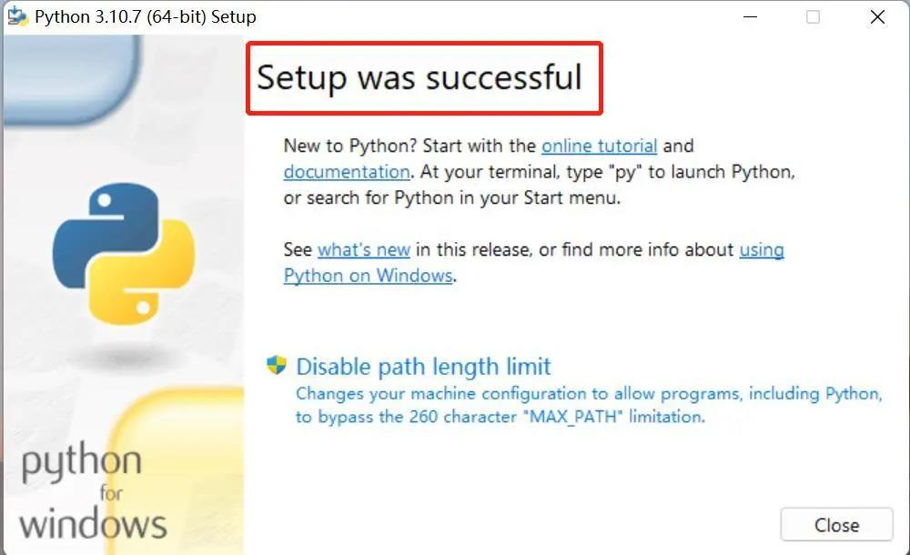


### 1.2 运行Python
打开命令提示符窗口（Win+R，输入“cmd”并按“Enter”）。 输入“Python”。

**安装成功：**

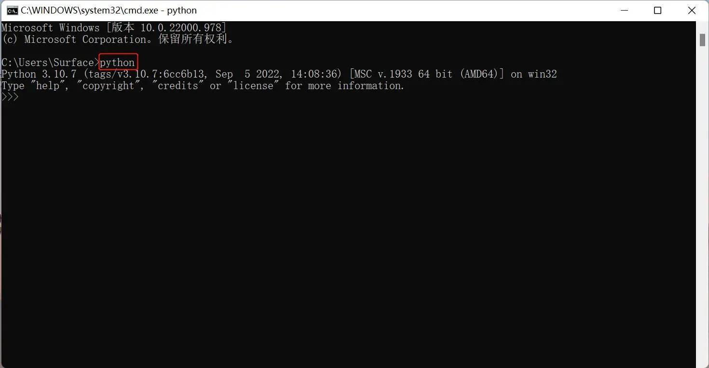

屏幕上出现此指示意味着 Python 已成功安装。 提示符“>>>”表示Python交互环境。 如果输入一段Python代码，立即得到执行结果。


**错误报告：**

如果输入了错误的指令，例如“pythonn”，系统可能会报告错误。

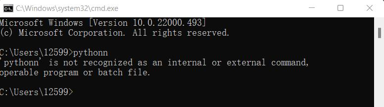

> **注意：** 一般情况下，该错误是由于环境配置不足造成的。 参考**1.3 环境配置**解决问题。


### 1.3 环境变量配置
Windows 遵循 Path 环境变量设置的路径来搜索 **python.exe** 。 否则会报错。 如果安装时没有勾选“Add Python 3.9 to PATH”，则需要手动将python.exe所在路径添加到环境变量中或者重新下载python。 请记住勾选“将 Python 3.9 添加到 PATH”。

按照以下步骤手动将 python 添加到环境变量中。

* 右键单击“我的电脑”图标 --> 属性 -> 高级系统设置 -> 环境变量


* 环境变量包括用户变量和系统变量。 对于用户变量，用户可以通过“cmd”命令使用自己下载的程序。 将目标程序的绝对路径写入用户变量中。


* 配置完成后，打开命令提示符窗口（Win+R；输入“cmd”并按“Enter”），然后输入“Python”。


### 2 PyCharm的安装

PyCharm 是一款功能强大、具有跨平台性质的 Python 编辑器。 请按照以下步骤下载并安装 PyCharm。

前往 **[PyCharm](http://www.jetbrains.com/pycharm/download/#section=windows)** 下载 PyCharm。

#### 2.1 下载与安装

官网查看：


建议安装免费版本。

* 点击“下一步”：

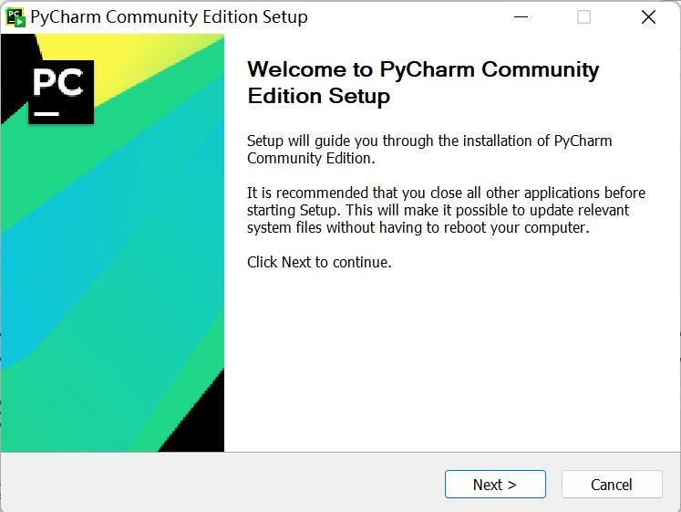

* 根据您的需要选择选项，然后选择“下一步”：


* 点击“安装”：

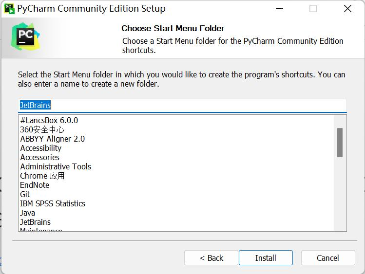

* 安装：

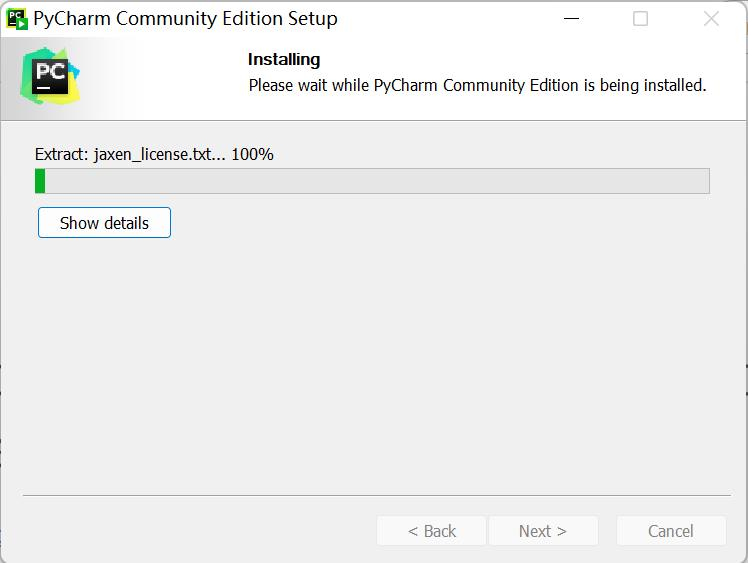

* 点击“完成”

   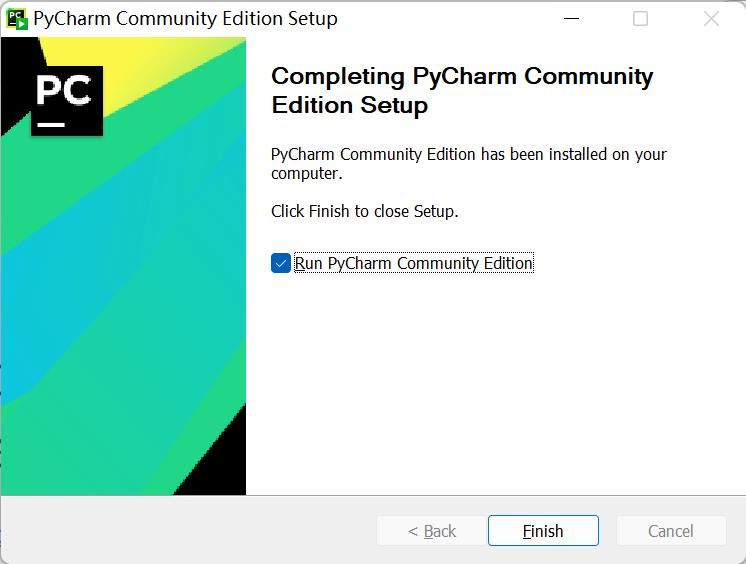
  


#### 2.2 创建新项目

* 点击“+新建项目”：

<!--  -->

* `Interpreter` 用于解释Python程序。 选择“添加解释器”->“新建”以添加基本解释器。

   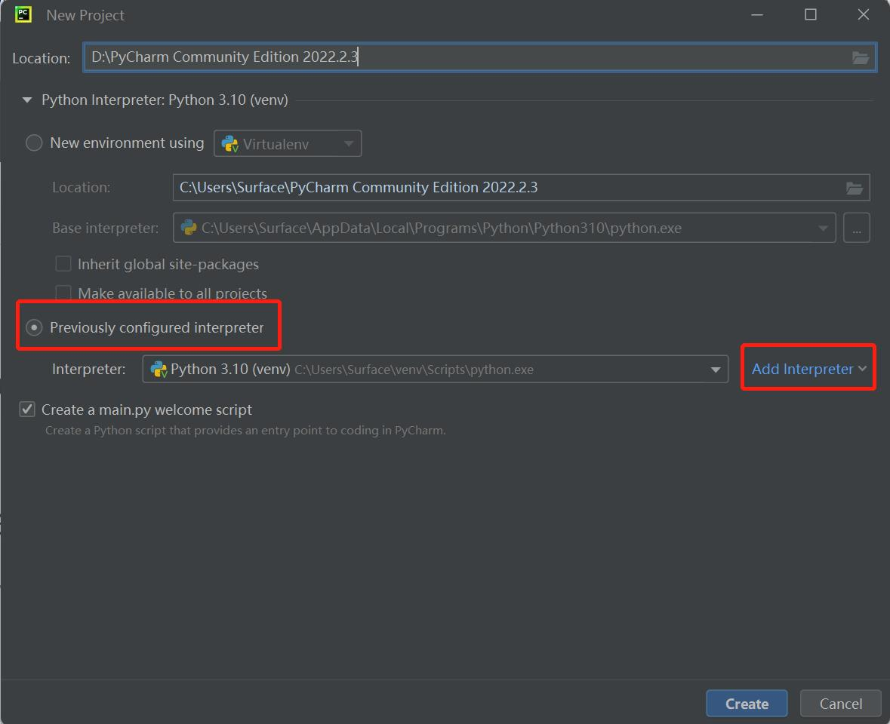

   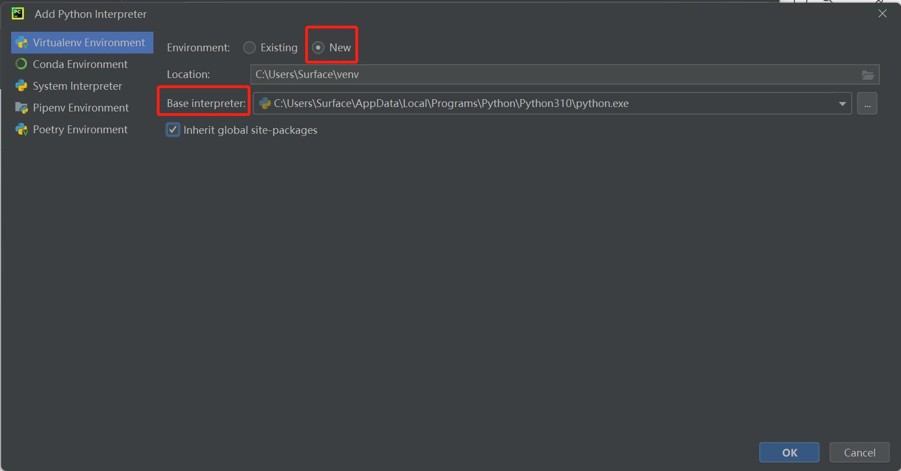

* `Location`是指保存python文件的位置。 选择一个文件来放置您的程序。

   

* 点击“创建”，会出现一个示例：
   <!--  -->

* 右键单击红色箭头所指的选项，然后创建一个新的 python 文件。

   <!--  -->

* 键入新文件的名称。

   <!--  -->


### **3 准备工作**

* pymycobot 安装。 通过终端（Win+R）“cmd”命令输入“pip install pymycobot --upgrade --user”。

   ````python
   pip install pymycobot --upgrade --user
   ````

  

   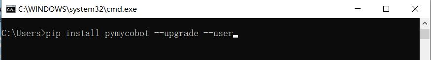

* 源码安装。 打开终端（Win+R，输入 `cmd` ），然后输入以下命令进行安装。

   ````python
   git clone https://github.com/elephantrobotics/pymycobot.git <your-path>
   #<your-path>中填写你的安装地址，不要选择当前默认路径。
  
   cd <your-path>/pymycobot
   #进入下载包的pymycobot文件夹。
  
   #根据您的python版本运行以下命令之一。
   ＃ install
    python2 setup.py install
   ＃ or
    python3 setup.py install
   ````

* 更新pymycobot

````bash
pip install pymycobot --upgrade
````


> **注意：**
>
> 1. 如果代码下方没有出现红色波浪线，则说明pymycobot安装成功。
> 2. 如果出现红色波浪线，请前往地址 **https://github.com/elephantrobotics/pymycobot** 手动下载 pymycobot 并将其放入 python 库中。
>
> 


## Python的基本使用

```python
from pymycobot import MercuryL1Client

mc = MercuryL1Client('192.168.1.232',netport=6501)

mc.power_on(0) # 左右臂同时上电

print(mc.get_angles())

```

----
[← 上一页](..//README.md) | [下一页 →](./6.1.2-ApplicationBasePython.md)