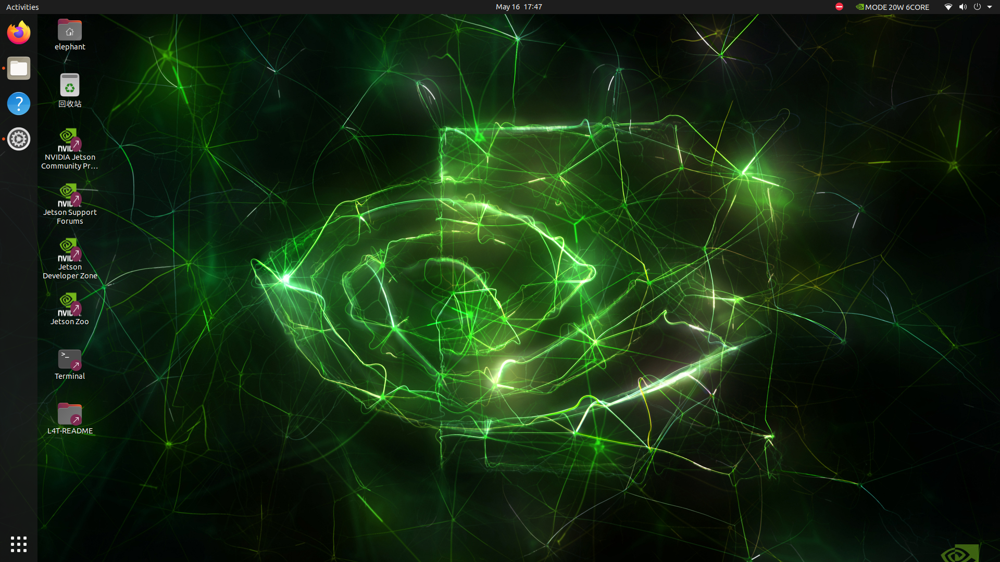
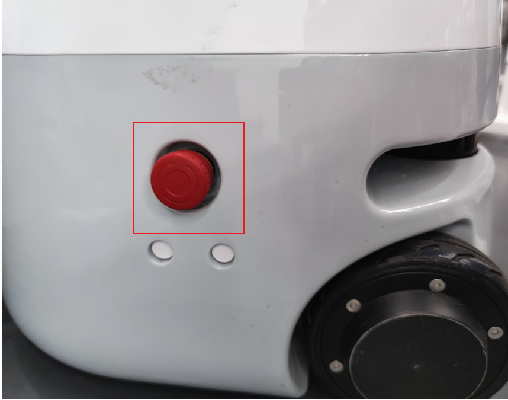
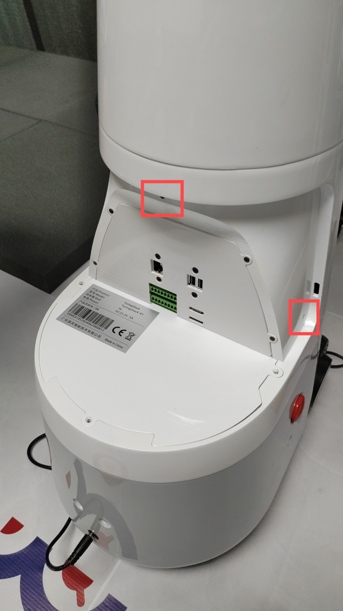
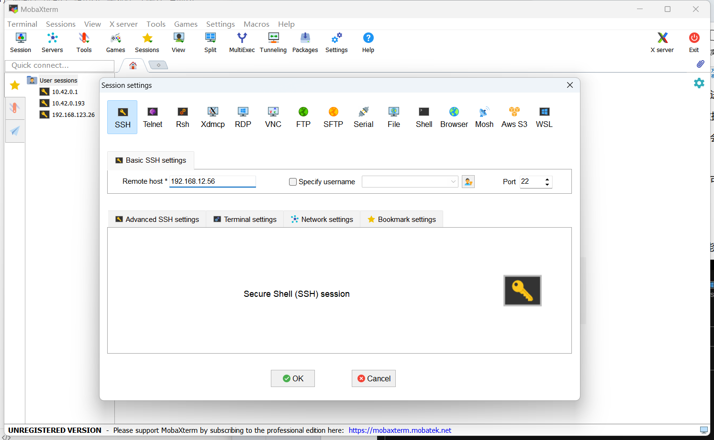
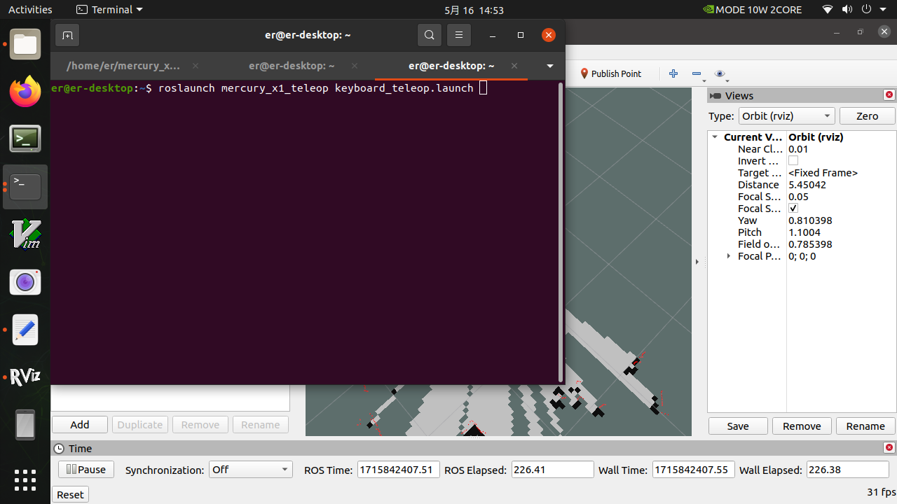
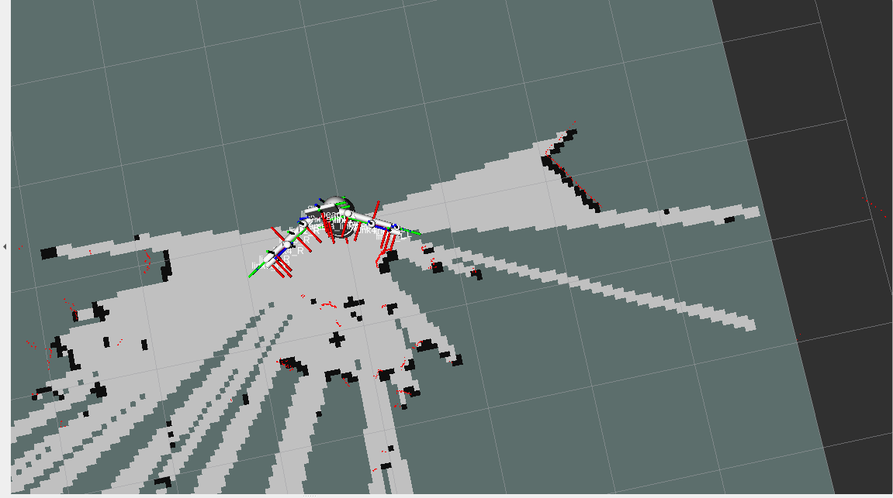

# 使用Gampping实时建图

作为 ROS 机器人，运动的控制与实现无疑是机器人最重要的一个部分，不管是建图还是简单的导航行为，都需要通过底座的运动来实现。在我们的底座中，运动的控制与实现是通过上位机与下位机通信来实现的，即 ROS 与 STM32 之间的通信，通过由 ROS 向 STM32 发布速度、STM32 再根据速度信息控制电机转速来使底座运动，同时通过 STM32 向 ROS 返回的数据来获取底座的速度与姿态。

## 1.前提准备

第一步，先打开电源开关。确保触头部的显示屏画面进入系统 。




第二步，是确保急停开关打开，如果不松开急停开关，是没办法控制双臂和底座。

松开急停开关是顺时针松开，按下急停开关代表断开双臂和底座的电源。



第三步，在急停开关打开后，观察底座的rgb灯，紫色频闪代表着低电量，而且底座电机没办法紧锁，此时要插上电源适配器进行充电。正常电量是蓝绿红rgb灯循环闪烁。


第四步，需要拆卸尾部和左右两侧的螺丝，往后推开底座的后盖。



第五步，外接无线鼠标键盘到mercury x1的usb接口上。


除了外接鼠标键盘操控mercury x1外，还有其他两种方法操作mercury x1。

第一种方法：你还可以直接在触摸屏上直接操作mercury x1。在触摸屏下方区域，按住向上滑动可以弹出虚拟键盘。


如果键盘敲下没有反应，可以按两下ⓧ激活键盘。隐藏虚拟键盘可以按下方向键隐藏。


第二种方法，使用 SSH 登录的方式来进行远程，SSH 是较可靠、专为远程登录会话和其他网络服务提供安全性的协议。这里使用 [MobaXterm free Xserver and tabbed SSH client for Windows (mobatek.net)](https://mobaxterm.mobatek.net/) 工具提供的 ssh 远程连接硬件设备。

打开底座，进入图形化界面，将底座连接 WiFi，打开 Terminal 进入终端界面(敲下键盘的Ctrl+Alt+T)，输入 ifconfig 命令查看此时的 IP 地址：


wlan0/wlan1 表示无线接口，简单理解就是当连接无线网络时就会调用这个接口 IP 进行连接。

此时底座是连接的无线网络，所以在 wlan0 模块出现了 IP 地址，接下来就可以使用这个 IP 进行连接，当然这个当然这个 IP 不是固定的，这与你当前网络 IP 有关。

在电脑上，连上和mercury x1同一个wifi，才可以使用mobaxterm的 ssh功能，点击Session图标,输入x1的ip，点击OK，第一次连接设备点击Accept



用户名：**elephant**
密码：**Elephant**

输入用户名：elephant 输入密码：Elephant ，密码在输入时不会显示出来，正常输入后敲下回车键登录


正常登录显示的画面，这个终端就可以敲指令远程控制mercury x1


## 2.启动底座的通信

在我们的 ROS 源码当中，通常我们采用 launch 文件来开启一个节点，而底座运动初 始 化 节 点 的 开 启 是 由 turn_on_mercury_robot 功 能 包 路 径 下 的turn_on_mercury_robot.launch 文件来实现的，启动指令如下：

```
roslaunch turn_on_mercury_robot turn_on_mercury_robot.launch
```

必须启动该 launch 文件才能实现 ROS与 STM32 的通信，底座才能运动。除键盘控制与无线手柄控制的 launch 文件之外，其他功能的 launch 文件中都嵌套运行了开启初始化节点，无需再运行一次底层节点的turn_on_mercury_robot.launch 文件，若重复调用会报错。

turn_on_mercury_robot.launch 文件由五部分组成：1、小车参数设置；2、开启底层单片机控制节点；3、导航局部路径规划算法选择；4、是发布用于建图、导航的 TF 关系与小车外形可视化；5、开启 ekf 扩展卡尔曼滤波算法。


## 3.打开Gampping建图launch文件

```
roslaunch turn_on_mercury_robot mapping.launch
```

```
roslaunch turn_on_mercury_robot slider_control.launch
```

```
roslaunch mercury_x1_teleop keyboard_teleop.launch
```
需要注意一点的就是，在运行mapping.launch时，是包含了turn_on_mercury_robot.launch的，不需要单独启动turn_on_mercury_robot.launch文件，如果再次启动会冲突导致报错。




此时就可以通过键盘来控制小车的运动了，根据终端提示来按键可进行小车的移动、转向、速度控制。

| 按键 | 方向               |
| ---- | ------------------ |
| i    | 前进               |
| ，   | 后退               |
| j    | 逆时针旋转         |
| l    | 顺时针旋转         |
| u    | 向左运动           |
| o    | 向右运动           |
| k    | 停止               |
| m    | 顺时针后退         |
| .    | 逆时针后退         |
| q    | 增加线速度和角速度 |
| z    | 减小线速度和角速度 |
| w    | 只增加线速度       |
| x    | 只减小线速度       |
| e    | 只增加角速度       |
| c    | 只减小角速度       |

## 4.开始建图

现在，mercury x1可以在键盘控制下开始移动。操纵mercury x1在所需的映射空间内旋转。同时，您可以在 Rviz 空间中观察到，随着x1的移动，我们的地图也在逐渐构建。

注意：使用键盘操作x1时，请确保运行 keyboard_teleop.launch 文件的终端是当前选定的终端；否则，键盘控制程序将无法识别按键。此外，为了获得更好的映射效果，建议在键盘控制时将线速度设为 0.15，角速度设为 0.4，因为较低的速度往往会产生更好的映射效果。"



## 5.保存构建好的地图

在一定范围内运动后，就可以建立一个相对比较完整的 2D 地图了，建图过程中出现的连续红点为激光雷达实时所探测到的障碍物，而黑色为雷达所确定的障碍物边界。


地图参数文件尽量都放在同一个文件夹内，方便管理，所以我们放在下面的路径下

```
cd mercury_x1_ros/src/turn_onmercury_robot/map
```

然后输入下面的指令，保存当前的栅格地图，然后我们就会在当前路径下（mercury_x1_ros/src/turn_onmercury_robot/map）生成了map.yaml和map.pgm的地图参数文件

```
rosrun map_server map_saver
```


当然，我们可以在后面加上参数-f，给地图参数文件增加后缀名

```
rosrun map_server map_saver -f map_demo_505
```

这样我们就会在当前路径下，生成map_demo_505.yaml和map_demo_505.pgm的地图参数文件，增加后缀这样做的好处就是便于管理自己需要的地图，避免出现覆盖掉之前辛苦建好的地图文件。

保存后可在/home/er/mercury_x1_ros/src/turn_on_mercury_robot/map路径下查看所保存地图的图片形式，为 pgm 格式。


