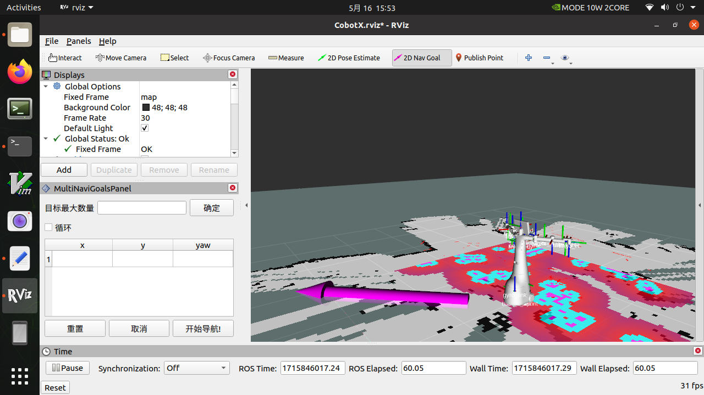
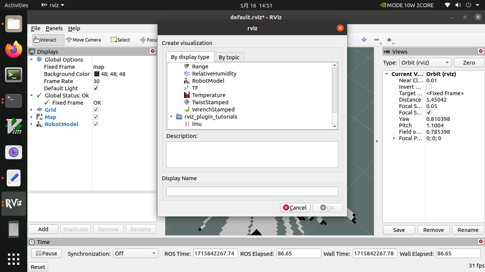
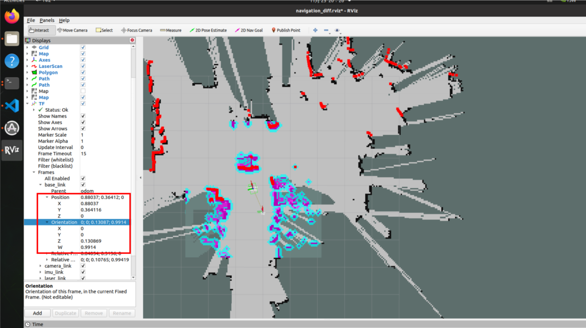

# navigation导航

1.在mercury_x1_ros/src/turn_on_mercury_robot/launch的路径下，找到navigation.launch文件，鼠标右键打开编辑该文件。


2.设置需要用于导航的地图

找到第11行的位置，这一行就是导入你所用于导航的地图参数文件。

```
<arg name="map_file" default="$(find turn_on_mercury_robot)/map/MERRCURY.yaml"/>
```


我这里就是用MERRCURY.yaml这个参数文件进行导航，当然你也可以改为你想要导航的参数文件。

举个例子，在gmapping的流程中，我在mercury_x1_ros/src/turn_onmercury_robot/map路径下生成map_demo_505.yaml，而且我需要用来导航，那么就得这么改。

```
 <arg name="map_file" default="$(find turn_on_mercury_robot)/map/map_demo_505.yaml"/>
```

3.启动roslaunch导航文件

确保你其他的终端程序已经关闭，然后打开一个新的终端执行以下指令

```
roslaunch turn_on_mercury_robot navigation.launch
```


4.会自动打开一个rviz可视化界面，机器人默认位姿就是在建图的起始点


可以点击2D Nav Goal发送导航目标点



了解左下角导航操作区

>① 可设置目标点的最大数量：要求所设置目标点个数不能大于该参数（可以小于）
>
>② 是否循环：若勾选，导航至最后一个目标点后，将重新导航至第一个目标点。例：1->2->3->1->2->3->···，该选项必须在开始导航前勾选
>
>③ 任务目标点列表： x/y/yaw，地图上给定目标点的位姿（xy坐标与航向角yaw)。
>
>- 设置完目标最大数量，保存后，该列表会生成对应数量的条目
>- 每给出一个目标点，此处会读取到目标点的坐标与朝向
>
>④ 开始导航：开始任务
>
>⑤ 取消：取消当前目标点导航任务，机器人停止运动。再次点击开始导航后，会从下一个任务点开始。
>
>例：1->2->3，在1->2的过程中点击取消，机器人停止运动，点击开始导航后，机器人将从当前坐标点去往3。
>
>⑥ 重置：将清空当前所有目标点


设置任务目标点个数，点击确认保存。然后点击ToolBar上的2D Nav Goal，在地图上给定目标点。（每次设置都需要先点击2D Nav Goal），目标点有朝向区分，箭头顶端为机器人朝前方向。点击开始导航，导航开始，在rviz中看到起点到目标点位间有一条机器人的全局规划路径，机器人会沿着路线运动到目标点位。


- 编写一个简单python实现导航点位的发送

```python
import sys
import rospy
import actionlib

from move_base_msgs.msg import MoveBaseAction, MoveBaseGoal
from actionlib_msgs.msg import *
from geometry_msgs.msg import Point
from geometry_msgs.msg import Twist

class MapNavigation:
    def __init__(self):
        self.goalReached = None
        rospy.init_node('map_navigation', anonymous=False)

    # move_base
    def moveToGoal(self, xGoal, yGoal, orientation_z, orientation_w):
        ac = actionlib.SimpleActionClient("move_base", MoveBaseAction)
        while (not ac.wait_for_server(rospy.Duration.from_sec(5.0))):
            sys.exit(0)

        goal = MoveBaseGoal()
        goal.target_pose.header.frame_id = "map"
        goal.target_pose.header.stamp = rospy.Time.now()
        goal.target_pose.pose.position = Point(xGoal, yGoal, 0)
        goal.target_pose.pose.orientation.x = 0.0
        goal.target_pose.pose.orientation.y = 0.0
        goal.target_pose.pose.orientation.z = orientation_z
        goal.target_pose.pose.orientation.w = orientation_w

        rospy.loginfo("Sending goal location ...")
        ac.send_goal(goal)

        ac.wait_for_result(rospy.Duration(600))

        if (ac.get_state() == GoalStatus.SUCCEEDED):
            rospy.loginfo("You have reached the destination")
            return True
        else:
            rospy.loginfo("The robot failed to reach the destination")
            return False

if __name__ == "__main__":
    goal_1 = [(-0.0277661, -0.00824622, 0.0431145, 0.999068)]   
    goal_2 = [(0.428357, -1.99509, 0.999547, -0.037365)]     
    goal_3 = [(0.318357, -2.10509, -0.681143, 0.732115)]     
    goal_4 = [(1.88323, -1.84847, 0.0746518, 0.997171)]     
    goal_5 = [(2.05847, -0.492321, -0.00194264, 0.999828)]  
    map_navigation = MapNavigation()

    x_goal, y_goal, orientation_z, orientation_w = goal_2[0]
    flag_feed_goalReached = map_navigation.moveToGoal(x_goal, y_goal, orientation_z, orientation_w)
    if flag_feed_goalReached:
        print("command completed")
    else:
        raise ValueError    
```

上面代码重点是各个goal_x的获取，可以通过以下操作进行获取。确保你其他的终端程序已经关闭，然后打开一个新的终端执行以下指令

```
roslaunch turn_on_mercury_robot navigation.launch
```

然后用键盘控制机器人控制到你需要定的导航点位上

```
roslaunch mercury_x1_teleop keyboard_teleop.launch
```

在rviz中点击左下角的Add，找到By display type的一栏，选中TF后点击OK



找到Frames->base_link中的Position和Orientation一栏，这个就是当前base_link相对于map的tf转换，记录下Position的X/Y和Orientation的Z/W，给到python代码中goal_1变量中，将改变量发给move_base后，就会开始导航到该点。



以此类推，用键盘控制到第二点，记录第二个位置goal_2

