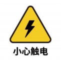
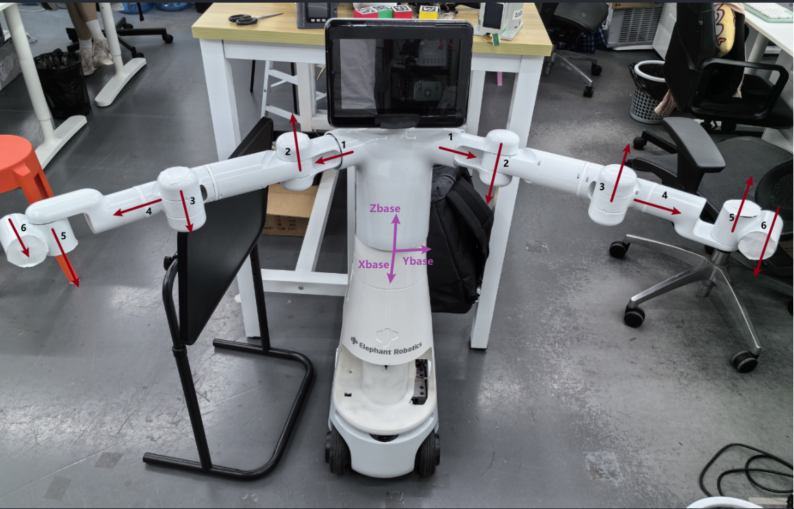
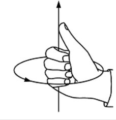
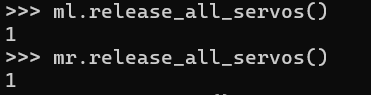
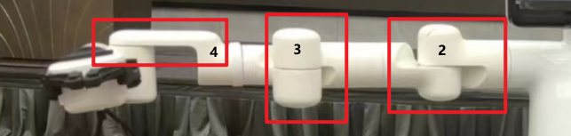
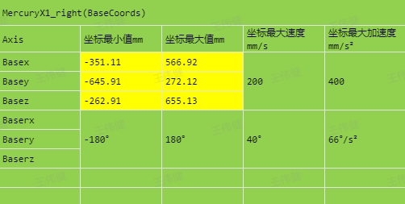
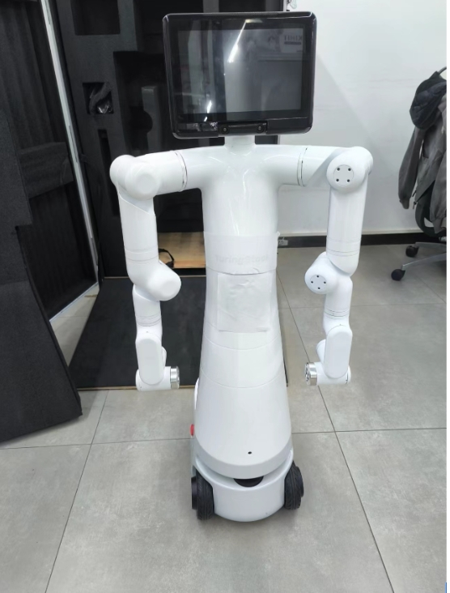

# User Instructions

 <br>

> This chapter is an important part that every user of this product must read carefully. It covers key information about product use, transportation, storage, and maintenance, aiming to ensure user safety and efficiency when operating the product. Additionally, this chapter details the responsibilities for product failures or damages caused by not following these guidelines.

## 1 Safety Instructions

### Overview

This chapter provides general safety information for personnel involved in the installation, maintenance, and repair of the Elephant Robot. Please read and understand the contents and precautions of this chapter carefully before handling, installing, or using the product.

### Hazard Identification

The safety of collaborative robots is based on the correct configuration and use of the robot. Additionally, even if all safety instructions are followed, operators may still cause injury or damage. Therefore, it is very important to understand the safety risks of using the robot to prevent them.

Tables 1-1 to 1-3 list common safety risks that may occur during the use of the robot:

<center>Table 1-1 Risk Levels and Safety Risks</center>

|        |
| ---------------------------------------------------------------------- |
| 1 Personal injury or robot damage caused by improper operation of the robot. |
| 2 If the robot is not fixed as required, such as missing screws or loose screws, or if the base's locking ability is insufficient to support the robot's high-speed movement, the robot will tip over, causing personal injury or robot damage. |
| 3 The robot's safety functions fail to work due to incorrect safety function configuration or lack of safety protection tools. |

<center>Table 1-2 Safety Risk Tips</center>

|                |
| ------------------------------------------------------------------------------- |
| 1 Do not stay within the robot's movement range when debugging programs. Improper safety configuration may not avoid collisions, causing personal injury. |
| 2 The connection between the robot and other equipment may bring new dangers, requiring a comprehensive risk assessment. |
| 3 Be careful of scratches and punctures caused by sharp surfaces such as other equipment in the working environment or the robot's end effector. |
| 4 Robots are precision machines; stepping on them may cause damage. Improper placement during transportation may cause vibrations, affecting internal parts and causing damage. Therefore, ensure stability and mechanical integrity in all situations. |
| 5 If the clamped object is not removed before the robot is powered off (when the clamping is not secure), it may cause damage to the end effector or the clamped object may fall and cause injury due to power failure. |
| 6 There is a risk of accidental movement of the robot. Do not stand under any axis of the robot under any circumstances! |
| 7 Compared to ordinary mechanical equipment, robots have more degrees of freedom and a larger range of motion. Failure to stay within the range of motion may cause accidental collisions. |

<center>Table 1-3 Potential Electrical Shock Hazards</center>

|  |
| ----------------------------------------------------------------- |
| 1 Using non-original cables may pose unknown dangers. |
| 2 Electrical equipment coming into contact with liquids may cause leakage hazards. |
| 3 Incorrect electrical connections may cause electric shock. |
| 4 Be sure to turn off the power of the controller and related equipment and unplug the power plug before replacement. Operating with power on may cause electric shock or malfunction. |

### Safety Precautions

**Follow these safety rules when using the robotic arm:**

- The robotic arm is an electrical device. Non-professionals should not change the circuit at will, otherwise, it may cause damage to the equipment or the human body.
- When operating the robotic arm, follow local laws and regulations. The safety precautions and dangers, warnings, and cautions described in this manual are only supplementary to local safety regulations.
- Use the robotic arm in the specified environment. Exceeding the specifications and load conditions of the robotic arm will shorten the product's service life and even damage the equipment.
- Under no circumstances should personnel installing, operating, and maintaining the Mercury arm be strictly trained on safety precautions and the correct methods of operating and maintaining the robot.
- Under no circumstances should this product be used in a humid environment for a long time. This product is a precision electronic component, and long-term exposure to a humid environment will damage the equipment.
- Under no circumstances should this product be used in a humid environment for a long time. This product is a precision electronic component, and long-term exposure to a humid environment will damage the equipment.
- High-corrosion cleaning is not suitable for cleaning the robotic arm, and anodized parts are not suitable for immersion cleaning.
- Unknowingly, do not use the equipment without installing the base to avoid damaging the equipment or causing accidents. The equipment should be used in a fixed environment without obstacles.
- Do not use other power adapters to power the device. If the equipment is damaged due to the use of non-standard adapters, after-sales service is not included.
- Do not disassemble, dismantle, or unscrew the screws or casing of the robotic arm. If disassembled by oneself, warranty service is not provided.
- Untrained personnel should not repair faulty products and disassemble the robotic arm without authorization. If the product fails, please contact Mercury technical support engineers in time.
- If the product is discarded, comply with relevant laws and properly dispose of industrial waste to protect the environment.
- Children should use the equipment at some point, forcing someone to monitor the process and turn it off after completion.
- Do not reach into the movement range of the robot arm when the robot is moving to avoid collisions.
- It is strictly forbidden to change, remove, or modify the nameplate, instructions, icons, and signs of the robotic arm and related equipment.
- Handle and install with care. Place the robot gently according to the instructions on the packing box and place it correctly according to the direction of the arrow. Otherwise, the machine may be damaged.

- **Do not burn other product drivers from the Atom terminal or use non-officially recommended firmware. If the equipment is damaged due to the user burning other firmware, it is not covered by after-sales service.**
- Power specifications: **Use official power supply**
- USB Type-C usage specifications: **Do not connect to the power board**

**If you have any questions or suggestions about the content of this manual, please log in to the Elephant Robotics official website and submit relevant information:**

https://www.elephantrobotics.com

**Do not use the robotic arm for the following purposes:**

- Medical care costs in life-critical applications.
- Buying a bus may cause an environmental explosion.
- Lent directly without risk assessment.
- Costs of using low-level safety functions.
- Lo-fi does not meet the performance parameters of robot use.

### Disclaimer

Please read and understand the following disclaimer before using the product:

- **Safe Use:** This product is designed for specific application scenarios. Ensure that all safety guidelines and operating manuals are followed during use. Users should receive appropriate training on product use and understand and comply with all relevant safety regulations.

- **Limitation of Liability:** The manufacturer is not responsible for any direct, indirect, incidental, special, or consequential damages resulting from the use or misuse of the product or any matters related to the product. This disclaimer does not cover or exclude liabilities that cannot be excluded by law.

- **Technical Support:** Please read the product documentation carefully during installation and use, and seek technical support from the manufacturer if necessary. For technical support issues, refer to the official documentation provided by the manufacturer or contact the relevant support channels.

- **Software Updates:** The manufacturer may provide updates to the product firmware or software. Users should regularly check and apply these updates to ensure product performance and safety.

- **Regular Maintenance:** Users should inspect and maintain the product according to the regular maintenance guidelines provided by the manufacturer. Regular maintenance and inspections help ensure the long-term performance of the product.

- **Customization and Modification:** Do not customize, modify, or alter the product without explicit permission from the manufacturer. Any unauthorized modifications may void the product warranty and may have unpredictable effects on safety and performance.

- **Legal Compliance:** Users should ensure that their use complies with all applicable laws and regulations. In some regions, the use of the product may be subject to specific regulations.

By using the Mercury X1 Wheeled Dual-Arm Humanoid Robot, you agree to and accept these disclaimers. The manufacturer reserves the right to change product specifications, functions, and disclaimers without notice.

## 2 Transportation and Storage

### Logistics Transportation Requirements

|      |    |
|  ----  | ----  |
| Temperature  | 0°C~50°C |
| Relative Humidity  | 20%~70% |
| Direction During Transportation | Robot head up, arms down |
| External Conditions During Transportation  | Fixed with wooden frame to prevent squeezing |
| Wooden Frame Size | 57\*57*120 |

 <center>

<br>Internal Packaging</center>

<center>

<br>External Packaging</center>

### 2 Equipment Storage

|      |    |
|  ----  | :----  |
| Temperature  | 0°C~50°C |
| Relative Humidity  | 20%~70% |
| Direction During Transportation | Robot head up, arms down |
| Stacking Requirements  | Cannot be stacked |
| Storage Environment | Indoor |
| Other Environmental Requirements | - Keep away from dust, oil smoke, salt, iron filings, etc. <br>- Keep away from flammable, corrosive liquids and gases. <br>- Must not come into contact with water. <br>- Avoid transmitting shocks and vibrations. <br>- Keep away from strong electromagnetic interference sources. |

## 3 Maintenance and Care

As a robot manufacturer, we emphasize ensuring that customers can properly and safely maintain and upgrade their robotic equipment. To this end, we provide the following detailed maintenance and care guidelines, including common maintenance items and parts for repair or upgrade. Please read carefully.

### Common Maintenance Items and Recommended Cycles

| Maintenance Item | Description | Recommended Cycle |
| :-----  | :-----  | :-----  |
| Visual Inspection | Check for obvious damage, foreign object accumulation, or wear on the robot | Daily |
| Structural Cleaning | Clean the robot's structural components with a clean, dry cloth, avoiding moisture and corrosive cleaners | Daily |
| Fastener Inspection | Check and tighten all bolts and connectors | Daily |
| Lubrication | Lubricate joints and moving parts with manufacturer-recommended lubricants | Every 3 months |
| Cable and Wiring Inspection | Check cables and wiring for damage or wear | Monthly |
| Electrical Connection Inspection | Ensure all electrical connections are secure, free of corrosion or damage | Monthly |
| Software Updates | Check and update control software and applications | Whenever updates are available |
| Software Data Backup | Regularly back up key software configurations and data | Quarterly |
| Firmware Updates | Regularly check and update firmware to get the latest features and security patches | Whenever updates are available |
| Sensor and Device Inspection | Check sensors and other key devices to ensure they are working properly | Monthly |
| Emergency Stop Function Test | Regularly test the emergency stop function to ensure its reliability | Monthly |
| Environmental Condition Monitoring | Monitor the working environment's temperature, humidity, dust, etc., to ensure it meets the robot's operating specifications | Continuous monitoring |
| Safety Configuration Review | Regularly check and confirm the robot's safety configurations, such as speed limits and working range settings | Monthly |
| Preventive Maintenance Plan Execution | Perform regular inspections and maintenance according to the manufacturer's maintenance plan | As per manufacturer's guidelines |

### Guidelines for Independently Changing Robot Hardware

We understand that customers may have the need to upgrade or repair robot hardware on their own. Before performing any upgrade operations, please read the relevant product parameters in detail and confirm with our official personnel whether such operations are allowed. Unauthorized operations may cause product failure and are not covered by the warranty.

#### Material Requirements

Officially manufactured or recommended materials: All parts and components required for repairs and upgrades must be officially manufactured or explicitly recommended by us. This includes but is not limited to electronic components, sensors, motors, connectors, and any other replaceable parts. <br>
Material acquisition: Customers can purchase the required repair and upgrade materials through our official channels. This ensures the quality and compatibility of the parts.

### Repair or Upgrade Process

Customer self-repair: Customers are responsible for completing the repair work. We will provide detailed repair guides and manuals to guide customers through the repair steps. <br>
Follow official guidance: Repair operations should strictly follow the official guidance provided by us. Any deviation from official guidance may cause equipment damage.

#### Responsibility and Warranty Policy

##### Responsibility Division:

Manufacturer: Provide official guidance for repairs and upgrades, officially manufactured or recommended materials, and handle issues caused by manufacturing defects. <br>
Customer: Responsible for completing repairs according to official guidance and using official parts.

##### Warranty Policy:

Warranty valid: The warranty is valid only if the repair operations fully comply with our guidance and use official parts. <br>
Warranty invalid: If the customer does not follow official guidance or uses non-official parts for repairs or upgrades, any damage caused will not be covered by the warranty.

#### Precautions

Safety first: Before performing any repair or upgrade operations, ensure that all safety guidelines are followed, including power-off and the use of appropriate protective equipment. <br>
Technical support: If you encounter problems during the repair process, it is recommended to stop the operation and contact our technical support team for assistance. <br>
We strongly recommend that customers strictly follow these guidelines to ensure the safe and effective operation of the robotic equipment. Improper repair operations may cause equipment damage and affect the warranty status. If you need further guidance or support, please contact our professional technical team in time.

## 4 Frequently Asked Questions

### How to Ask Questions Gracefully

#### 1 When asking questions in various places, you may encounter the following phenomena:

- No response after asking a question.
- The question is answered after a long time.
- The other party always complains that you are too inexperienced.

#### 2 Before asking a question, make sure you have studied this manual.

Many questions will be resolved in this process. Avoid asking questions in QQ groups, forums, issues, or emails right from the start. Many questions that are explained in the documentation may not receive timely responses from the community. To save everyone's time and create a better community environment, please understand each other and grow together.

#### 3 When asking questions, try to do the following, which will greatly increase the chances of quickly resolving the issue:

##### Make sure to clarify what happened, what I did, including:

- What effect or function do I want to achieve?

- How did I do it to achieve this effect, what was the specific process?

- What errors occurred during the implementation, what were the phenomena (for example, what was the reported error, what was the **complete** error content)?

- Did I carefully read the error message, did the error message indicate the cause and solution?

- Based on these error messages, can I solve the problem by thinking carefully?

- Can I find a solution to the problem by searching the documentation, issues, and using search engines?

#### 4 If I really can't solve the problem myself and need help, consider:

- Who to ask, where to ask, who is more likely to answer my question? And how timely is it?

- What data and phenomena should I provide to make them willing to quickly help me solve the problem?

  - Provide my purpose (to let the responder know what you are doing)
  - Provide the complete implementation process and the phenomena that occurred during the process (to allow the responder to follow your process and reproduce the problem)
  - Point out where the error occurred, indicating where the phenomenon or result differs from my expectations! (Let the responder know where it did not meet expectations)
  - Provide the error message, which needs to be complete, with as many screenshots and logs as possible. Don't be stingy with a small screenshot or only provide part of the log (because the responder may not have done this for a long time and may have forgotten some details, they need to quickly recall through screenshots and complete logs; and detailed logs can quickly locate the problem)

- How to ask questions in a way that seems sincere, even if I am inexperienced, everyone is willing to answer

#### 5 Question Template

Try to ask questions gracefully, without adding unnecessary tone words, complaining words, carefully consider each word and punctuation, and think from the responder's perspective on how to quickly help solve the problem. Too few words may not describe the problem clearly, and too many words may make people impatient.

#### 6 Title

No matter where you ask questions (including `QQ groups`), give your question a title of about 30 words, clarifying the central idea of the problem, including:

- The type of problem, whether it is a question, a bug submission, or an experience sharing, etc. Let everyone know what you want to do at a glance on a screen full of text
- Clarify the central idea of the problem in one sentence, such as `Running the camera example program, error reset fail, possibly a hardware issue`

So the comprehensive title can be like this:

- `【Mercury Question】 Running the camera example program, error reset fail, possibly a hardware issue`

Such titles should **not** appear:

- `Ah, why is my board not working again`
- `Why can't my code run`
- `Why is my screen black`
- `【Mercury Question】 Received the development board, the screen is red with a line of small text, why`
- `I ran the xxx program and there was a problem`

You can ask like this:

- `【Mercury Question】 My board cannot start after I connected the power supply in reverse. How can I determine where the board is burned, and if possible, how can I revive it`

#### 7 Content

First, from the responder's perspective, if asked a question:

- First, know what the other party wants to do, what goal to achieve
- What steps did they follow to achieve this goal
- What specific steps were taken, and where did the problem occur, so I can try to reproduce the phenomenon by following their steps. If this problem seems difficult to solve and there are no reproduction steps, it may take a lot of time to reproduce, so I will solve other problems first
- What exactly is the problem, if they only say there is a problem, how do I know what the problem is, maybe they are feeling unwell? So this is very important, they need to explain the phenomenon when the problem occurs and point out how it differs from expectations, otherwise, I have to guess and compare with expectations, which increases the time to solve the problem
- When a problem occurs, I may need their log files to analyze the source code, otherwise, it may be difficult to solve the problem, so this problem can be put aside for later

In summary, you can ask questions like this:

- Clearly state your goal, what you want to achieve, and what the expected phenomenon should be
- Have I referred to any documentation, code, or tutorials
- How to reproduce the error: specifically what was done, write down each step in detail until the problem occurs
- Clearly describe the phenomenon when the error occurs and how it differs from expectations, proving that the problem indeed occurred
- Attach log files, screenshots, and even videos. Logs and screenshots must be complete, do not only provide a small part. The responder may notice some issues you didn't pay attention to from your complete logs and screenshots, which is very important
- Additionally, paste the code with proper formatting, so it is readable and can be run directly
- Finally, express gratitude to the community friends who answered the questions

If you have read all the content of this chapter, you can continue to the next chapter.

### Driver Related

#### 1 About Python

**Q: What do the parameters in the API send_base_coords([x, y, z, rx, ry, rz], speed) mean? What do rx, ry, and rz correspond to in Euler angles? What is the rotation order of Euler angles? What is the range of each parameter?**

- A: The parameters in the array are the coordinates of the Mercury X1 end, and speed is the velocity. rx, ry, and rz correspond to RPY, which are roll, pitch, and yaw respectively. The Euler angle order is zyx, which is its own coordinate. The range for x, y, z is -350 to 350, -350 to 350, -41 to 523.9 (undefined range, if exceeded, an inverse kinematics no solution prompt will be returned). The range for rx, ry, rz is -180 to 180.

**Q: Are the Python APIs the same for different versions of the robotic arm?**

- A: The API is the same.

#### 2 About ROS

**Q: Can you provide the rviz model files and programming examples?**

- A: They can be found on our GitHub.
“https://github.com/elephantrobotics/mercury_x1_ros”

**Q: Mercury's urdf file path**

[Mercury X1](https://github.com/elephantrobotics/mercury_x1_ros/tree/main/turn_on_mercury_robot/urdf/mercury_x1)

[Mercury A1 & B1](https://github.com/elephantrobotics/mercury_ros/tree/noetic/mercury_description/urdf)

### Software Issues

#### About ROS1

**Q: When switching to ~/catkin_ws/src in the terminal and using git to install or update mercury_x1_ros, the target path “mercury_x1_ros” already exists. What is the reason?**

- A: This means that there is already a “mercury_x1_ros” package in ~/catkin_ws/src. You need to delete it in advance and then re-execute the git operation.

**Q: Simply cloning the mercury_x1_ros package and then directly running the rosrun program results in errors such as “package 'mercury_x1_ros' not found” or errors like files not found?**

- A: The newly cloned mercury_x1_ros needs to build the ROS environment compiled code. Enter in the terminal:

```
bash
cd ~/catkin_ws/
catkin_make
source devel/setup.bash
```

#### About Robotic Arm Control

**Q: How does Mercury X1 control the waist and neck joints?**

- A: It can only be controlled by the right arm. After the right arm serial port is connected, control it through the right arm
mr.send_angle(1,20,10) controls the right arm joint module to rotate +20°, speed 10
mr.send_angle(11,-20,10) controls the chin servo to rotate -20°, speed 10
mr.send_angle(12,20,10) controls the neck servo to rotate +20°, speed 10
mr.send_angle(13,20,10) controls the waist joint module to rotate +20°, speed 10

**Q: Mercury's right arm cannot be enabled, mr.power on() returns a value of 2, what should I do?**


A: Mercury cannot be enabled

1. First, if the robot arm is powered on normally, the return value is 1, indicating that the boot is normal.
It may be beyond the limit. Please take a picture of the robot arm's posture at this time and let's see if it is the problem.
2. Notes on the use of the right arm of the edu machine:
After taking the emergency stop, wait 8s before powering on (hear the buzzer)
After powering off the left arm, wait 8s before powering on the right arm. You can read is_power_on() before powering on

**Q: Exoskeleton linkage, VR linkage, speed fusion interface related content**

- A: https://github.com/elephantrobotics/RobotFollow.git

**Q: The robotic arm does not move when sending angles or coordinates to it.**

- A: Use `get_angles()` to read the angles of the robotic arm. If the angles return empty, check if the robotic arm is powered on, use `power_on()` to enable the robotic arm; check if the port number is used correctly.
If there are angles, check if the angles exceed the movement range as shown in Table 1. If they exceed the range, use `release_all_servos()` to relax all joints (note that the joints will fall after relaxation, you need to catch them), align the zero scale lines of joints 1~5, 7, and make joint 6 perpendicular to the zero scale line by 90 degrees. Then use `focus_all_servos()` to lock the joints, and use `set_servo_calibration(1)~set_servo_calibration(7)` to calibrate the zero points of each joint in sequence, then use `get_angles()` to read the current joint angles. If the returned data is [0, 0, 0, 0, 0, 90, 0], the calibration is successful, otherwise, repeat the previous calibration steps.

<center> Table 1-1 Joint Angle Movement Range</center>

|   Joint   | Range   |
|  :----:  | :----:  |
| J1  | -175 ~ +175 |
| J2  | -65 ~ +115 |
| J3| -175 ~ +175 |
| J4  | -180 ~ +10 |
| J5| -175 ~ +175 |
| J6| -20 ~ + 173 |
| J7| -180 ~ +180 |

**Q: The camera cannot be opened.**

- A: Open the local camera to see if it can switch to the left and right arm cameras. If a certain camera cannot be viewed, re-plug the USB port or change the USB port.
If it can switch to the left and right cameras, check if the camera port has changed (the port may change after restarting).

**Q: The adaptive gripper cannot be controlled.**

- A: Check the power indicator of the adaptive gripper. The indicator should be steady on when normal. If the indicator flashes, re-plug the connection cable between the gripper and the robotic arm. If the indicator returns to steady on, it is normal.
If the indicator is steady on but still cannot be controlled, use `set_gripper_mode(0)` to change the gripper usage mode.

**Q: The base cannot move.**

Enter in the terminal:
```
roslaunch turn_on_mercury_robot turn_on_mercury_robot.launch
rostopic echo /PowerVoltage
```
Check the battery level. If the battery level is below 21V, the base cannot be used. Please charge it before continuing to use it.

#### 3 Joint Movement MOVJ

**The joint movement of the robot arm refers to the joint motor driving the connecting rod to rotate**


**The joint movement has a rotation direction, and the direction of each joint can be determined by the following figure and the right-hand rule**



Right-hand rule:



**The thumb of the right hand points to the direction of the rotation axis, and the rotation direction shown in the figure is the positive direction of the joint rotation.**

##### Joint zero position

Joints have zero positions. The zero positions of all joints in the figure below are [0, 0, 0, 0, 90, 0]


Zero positions are artificially defined. When the 5 joints are at zero position, there is a 90° offset, which will prevent the end fixture from colliding with the body during the return to zero process.
- **Verify the joint zero point**
Enter the following command in Terminal to power on the robot

```python
python
from pymycobot import Mercury
mr = Mercury("/dev/right_arm") #connect to Mercury right arm
ml = Mercury("/dev/left_Arm") #connect to Mercury left arm
ml.power_on()
mr.power_on()
# Use the relaxation command to release the joint motor (Note! After relaxation, you need to hold the joint to prevent the robot arm from falling and being damaged!)
ml.release_all_servos()
mr.release_all_servos()
```



Manually drag the robot back to the zero position


The position of the zero point can be determined by the following details



Send command to lock motor

```python
ml.focus_all_servos()
mr.focus_all_servos()
```


- **Check if the zero position is correct**

Enter the command to get the joint angle to query the current position
```python
ml.get_angles()
mr.get_angles()
```
If the returned joint angle is close to [0, 0, 0, 0, 90, 0], the zero point is considered correct

- **Zero point calibration**
If the joint angle read at the zero position is very different from [0, 0, 0, 0, 90, 0], the joint zero position needs to be calibrated

```python
for i in range(1,7):
ml.set_servo_calibration(i)
mr.set_servo_calibration(i)
```

After calibration, read the joint information. If the return value is [0, 0, 0, 0, 90, 0], it means the calibration is successful
```python
ml.get_angles()
mr.get_angles()
```

#### 4 Coordinate motion MOVL

##### Base coordinate system definition

The origin of the Base coordinate system of the dual-arm robot is at the waist of the robot, and the coordinate axis directions {Xb, Yb, Zb} are as shown in the figure


The coordinates of the robot refer to the position (x, y, z) and posture (rx, ry, rz) of the center point of the flange at the end of the robot in the Base coordinate system (position (x, y, z, rx, ry, rz)).
The coordinate control of the robot refers to controlling the end of the robot to move the position or rotate the posture in the Base coordinate system.

##### Initial posture of coordinate movement

Coordinate movement MOVL will ensure that the end of the robot moves in a straight line trajectory, so a good initial posture can effectively prevent the robot from falling into a singularity or joint limit

- **Not recommended initial position**: send_angles([0,0,0,0,90,0],10), the maximum value of the 3 joints is 5°, and the 3 joints in the initial position are 0° close to the limit value.
- **Recommended initial position**: send_angles([0,0,-90,0,90,0],10), most coordinate movements can be achieved under this posture

##### Coordinate movement range




##### How to effectively control coordinate movement

**Method 1:**
- 1 Use joint instructions to move to the appropriate initial position: `send_angles([0,0,-90,0,90,0],10)）`
- 2 Read the current coordinates and assign values: `Current_coords = ml.get_base_coords()`
- 3 Modify Current_coords, for example: control x to increase by 50mm `Current_coords[0] += 50`
- 4 Send the modified coordinates: `ml.send_base_coords(Current_coords, 10)`

**The robot will move 50mm along the X axis of the Base coordinate system**

**Method 2:**
- 1 Use joint instructions to move to the appropriate initial position: `ml.send_angles([0,0,-90,0,90,0],10)）`
- 2 Use the single-axis movement interface: `ml.send_base_coord(2, -50, 10)`

**The robot will move -50mm along the Y axis of the Base coordinate system**

**Method 3:**
- 1 Use joint instructions to move to the appropriate initial position: `ml.send_angles([0,0,-90,0,90,0],10)`
- 2 Use the release instruction to relax all joints: `ml.release_all_servos()`
- 3 Manually drag the end of the robot arm to the target position
- 4 Lock the joint and record the current Base coordinates
  ```python
  ml.focus_all_servos()
  target_coords = ml.get_base_coords()
  ```
- 5 Return to the initial position and send the target position
  ```python
  ml.send_angles([0,0,-90,0,90,0],10)
  ml.send_base_coords(target_coords, 10)
  ```

**The robot arm will move from the initial position to the target coordinates**

##### Abnormal command processing

If you encounter a situation where the command does not respond, the joint does not move, or the point is not executed in place, you can use the following interface to troubleshoot the cause:
```python
ml.get_error_information()
ml.get_robot_status()
```
After getting the return information, just contact our engineer

### Hardware Issues

**Q: How to pack Mercury? In what posture?**

- A: There is a script for packing posture of the seven-axis version. Run B1-test many.py. After running, return to zero 12 times and pack posture 15 times.



#### 1 About Structure

**Q: What is the role of Atom in the robotic arm?**

- A: Atom mainly controls the kinematic algorithms of the robotic arm, including forward and inverse kinematics, solution selection, acceleration and deceleration, speed synchronization, multi-power interpolation, coordinate transformation, etc. Programs related to Atom are not yet open source.

#### 2 About Parameters

**Q: What is the unit of speed for the robotic arm?**

- A: The running speed is 180 degrees/second.

**Q: Can the adaptive gripper not be fully closed?**

- A: There will be a certain gap between the jaws, they are not fully closed. You can adjust it by increasing the thickness of the gap between them.

**Q: How to fix the USB camera at the end of the robotic arm?**

- A: It needs to be fixed with a flange, which can be purchased separately.

If you have purchase intentions or any parameter questions, please send an email to this address.
[Email](sales@elephantrobotics.com): "sales@elephantrobotics.com"

If the listed issues cannot help you solve the problem and you have more after-sales questions, please send an email to this address.
[Email](support@elephantrobotics.com): "support@elephantrobotics.com"

----
[← Previous Chapter](/2-ProductFeature/README.md#) | [Next Chapter →](/4-FirstInstallAndUse/README.md)