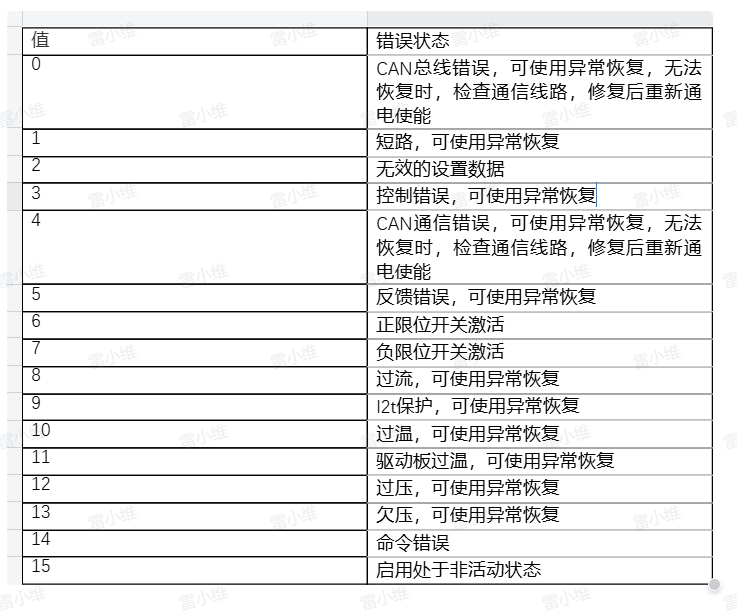
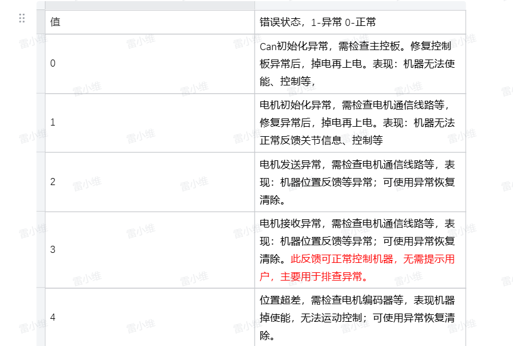
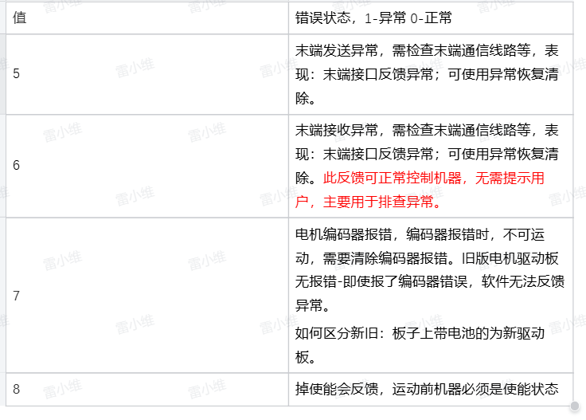

# Robot Arm Exception Inspection and Handling Methods

When the robot arm fails to execute motion commands successfully, corresponding exception information can be queried in the Python terminal： 

## 1 Check Robot Status

### 1.1 Status Feedback Analysis

Normally, this interface returns all zeros, indicating no issues. The robot status can be read, with feedback differing between the left and right arms, as detailed below: 

#### Read Robot Status
***
	m.get_robot_status()  # Read robot status

#### Left Arm Status Explanation
`[0,0,0,0,0,0,0,0,0,0,0,0,0,0,0,0,0,0,0,0,0,0,0]` represents: 
The robot is not moving, with no joint limit violations, hardware errors, or software errors. 

Each value corresponds to the following explanation. 
`[Reserved, Movement Status, J1 Limit Violation, J2 Limit Violation, J3 Limit Violation, J4 Limit Violation, J5 Limit Violation, J6 Limit Violation, J7 Limit Violation, J1 Hardware Error, J2 Hardware Error, J3 Hardware Error, J4 Hardware Error, J5 Hardware Error, J6 Hardware Error, J7 Hardware Error, J1 Software Error, J2 Software Error, J3 Software Error, J4 Software Error, J5 Software Error, J6 Software Error, J7 Software Error]`

**Examples:** 
`[0,1,0,0,0,0,0,0,0,0,0,0,3,0,0,0,0,0,0,0,0,0,0]` represents: 
The robot encountered a control error on J4 while moving. 

`[0,0,0,1,0,0,0,0,0,0,0,0,0,0,0,0,0,0,0,0,0,0,0]` represents: 
Robot J2 overlimit. 

`[0,0,0,0,0,0,0,0,0,0,0,0,0,0,0,0,0,0,0,0,3,0,0]` represents: 
Robot J5 circuit anomaly - reception error. 

#### Right Arm Status Explanation
`[0,0,0,0,0,0,0,0,0,0,0,0,0,0,0,0,0,0,0,0,0,0,0,0,0,0,0,0]` represents: 
The robot is not moving, no joint overlimit, no joint hardware errors, no joint software errors. 

The complete analysis of each value is as follows:: 
`[Reserved, Is moving, J1 overlimit, J2 overlimit, J3 overlimit, J4 overlimit, J5 overlimit, J6 overlimit, J7 overlimit, J13 overlimit, J1 hardware error, J2 hardware error, J3 hardware error, J4 hardware error, J5 hardware error, J6 hardware error, J7 hardware error, J13 hardware error, J11 hardware error, J12 hardware error, J1 software error, J2 motor software error, J3 software error, J4 software error, J5 software error, J6 software error, J7 software error, J13 software error]` 

**Examples:** 

`[0,1,0,0,0,0,0,0,0,0,0,0,0,4,0,0,0,0,0,0,0,0,0,0,0,0,0,0]` represents: 
The robot reports an error while moving, J4 reports a control error. 

`[0,0,0,1,0,0,0,0,0,0,0,0,0,0,0,0,0,0,0,0,0,0,0,0,0,0,0,0]` represents: 
Robot J2 overlimit. 

`[0,0,0,0,0,0,0,0,0,0,0,0,0,0,0,0,0,0,0,0,0,0,0,0,1,0,0,0]` represents: 
Robot J5 circuit anomaly - reception error. 

`[0,0,0,0,0,0,0,0,0,0,0,0,0,0,0,0,0,0,1,1,0,0,0,0,0,0,0,0]` represents: 
Robot binoculars and neck communication error. 

### 1.2 Error Resolution
#### Joint Overlimit
When a joint exceeds its limit, one of the following methods can be used to resolve it: 
##### Perform overlimit return to zero:
 The robot will return to the origin at a slower speed. 
**** 
	m.over_limit_return_zero() 
##### Release the joint and manually move it back within the limit:

****
	m.release_all_servo() 
#### Joint Hardware Error
Most hardware errors can be recovered using an exception recovery method: 
****
	m.servo_restore(ID) 
If the issue persists after using exception recovery or rebooting the robot, please contact our engineers. For detailed joint hardware errors, refer to Figure 1: 
 

#### Joint Software Error
Software errors mainly include: circuit anomalies, CAN module anomalies, encoder anomalies, loss of enable, etc. 

When there is a loss of enable, use the following to re-enable the servo before continuing movement: 
****
	m.focus_all_servo() 
For other anomalies, please contact our engineers. Detailed joint software errors can be found in Figures 2 and 3: 

#### Robot in Motion State, but Unable to Move

If the robot is in a motion state and does not respond to new motion commands, first stop the robot's motion: 
***
	m.stop() 
	m.resume() 
If the robot still cannot move, please contact our engineers. 

## 2 Check the feedback of executing motion commands

### 2.1 Motion Exceptions

#### Controlling the Robotic Arm to an Out-of-Range Position
    form pymycobot import Mercury
    m = Mercury('/dev/ttyAMA1')

    m.set_joint_max_angles(1,45) # Set joint 1 limit to 45°
    m.send_angle(1,50,10)   # Control joint 1 to rotate to 50°

At this point, the robotic arm will stop at the limit position and display the following message:

**Error: Joint 1 is close to the limit, current angle is 45.535, angle range: -165.0 ~ 45.0**

##### Solution: Avoid software limit by following the indicated angle range.
****

#### Cartesian Motion

    m.send_angles([0.0, 0.0, 0.0, -90.0, 0.0, 89.999, 0.0], 10) # Move the robotic arm to the initial posture

    m.send_coord(1,-200,10)  # Move the robotic arm to the coordinate position x = -200

At this point, the robotic arm stops mid-motion and displays the following message:

**Error: Joint 2 is close to the limit, current angle is -49.967, angle range: -50.0 ~ 120.0**

##### Solution: Avoid software limit by following the indicated angle range.
****

    m.send_coord(3,500,10) # Move the robotic arm to the coordinate position z = 500

At this point, the robotic arm stops mid-motion and displays the following message:

**Error: No adjacent solution for linear motion. Check if the arm span is near the limit. Current arm span is 370, maximum arm span is 440  **

##### Solution: Retract the robotic arm.

****
    m.send_angles([0.0, 0.0, 0.0, -90.0, 0.0, 0, 0.0], 10) # Change initial posture
    m.send_coord(1,200,10) # Move the robotic arm to the coordinate position x = 200

At this point, the robotic arm does not respond to the command and displays the following message:

**Error: Singular position, no solution found. Use send_angles() method to leave this position. Singularity detected at joint 6: 0.0 degrees**

##### Solution: Move out of the singular position as instructed.
****

    m.send_angle(6,90,10) # Use joint motion to move out of the singular position
    m.send_coord(1, 474, 10) # Send a set of coordinates that exceed the robotic arm’s range

At this point, the robotic arm does not respond to the command and displays the following message:

**Error: Sent coordinate data is out of range**

##### Solution: Send coordinate values within the limit.
****
 
### 2.2 Motion Exceptions

#### Controlling the Robotic Arm to an Out-of-Range Position
    form pymycobot import Mercury
    m = Mercury('/dev/ttyAMA1')

    m.set_joint_max_angles(1,45) # Set joint 1 limit to 45°
    m.send_angle(1,50,10)   # Control joint 1 to rotate to 50°

At this point, the robotic arm will stop at the limit position and display the following message:

**Error: Joint 1 is close to the limit, current angle is 45.535, angle range: -165.0 ~ 45.0**

##### Solution: Avoid software limit by following the indicated angle range.
****

### Cartesian Motion

    m.send_angles([0.0, 0.0, 0.0, -90.0, 0.0, 89.999, 0.0], 10) # Move the robotic arm to the initial posture

    m.send_coord(1,-200,10)  # Move the robotic arm to the coordinate position x = -200

At this point, the robotic arm stops mid-motion and displays the following message:

**Error: Joint 2 is close to the limit, current angle is -49.967, angle range: -50.0 ~ 120.0**

##### Solution: Avoid software limit by following the indicated angle range.
****

    m.send_coord(3,500,10) # Move the robotic arm to the coordinate position z = 500

At this point, the robotic arm stops mid-motion and displays the following message:

**Error: No adjacent solution for linear motion. Check if the arm span is near the limit. Current arm span is 370, maximum arm span is 440  **

##### Solution: Retract the robotic arm.

****
    m.send_angles([0.0, 0.0, 0.0, -90.0, 0.0, 0, 0.0], 10) # Change initial posture
    m.send_coord(1,200,10) # Move the robotic arm to the coordinate position x = 200

At this point, the robotic arm does not respond to the command and displays the following message:

**Error: Singular position, no solution found. Use send_angles() method to leave this position. Singularity detected at joint 6: 0.0 degrees**

##### Solution: Move out of the singular position as instructed.
****

    m.send_angle(6,90,10) # Use joint motion to move out of the singular position
    m.send_coord(1, 474, 10) # Send a set of coordinates that exceed the robotic arm’s range

At this point, the robotic arm does not respond to the command and displays the following message:

**Error: Sent coordinate data is out of range**

##### Solution: Send coordinate values within the limit.
****

### 2.2 Motor Exceptions

In firmware version V1.0, when a motor exception occurs, the robotic arm does not respond to motion commands, and corresponding error codes are displayed in the terminal, such as:

    0x31（49）：Lost enabling;
    0x32（50）：Motor error;
    0x33（51）：Motor encoder error.

If the lost enabling error occurs, re-enable by executing the following program:

    m.focus_all_servos()

If a motor encoder error occurs, check the current angle, execute the program below, then power off the device. If the encoder error persists, contact our engineers.

    m.get_angles() # Check the current angles   

After a motor error, run the following program:

    for i in range(1,8):
        m.servo_restore(i) # Clear motor error
    # Power cycle the device
    m.power_off()
    m.power_on()

If a motor exception continues to display during motion, please contact our engineers.

## 3 Usage Note

After the left arm executes power_off(), you need to first execute power_on() before performing power_off() and power_on() for the right arm to start the robot. 