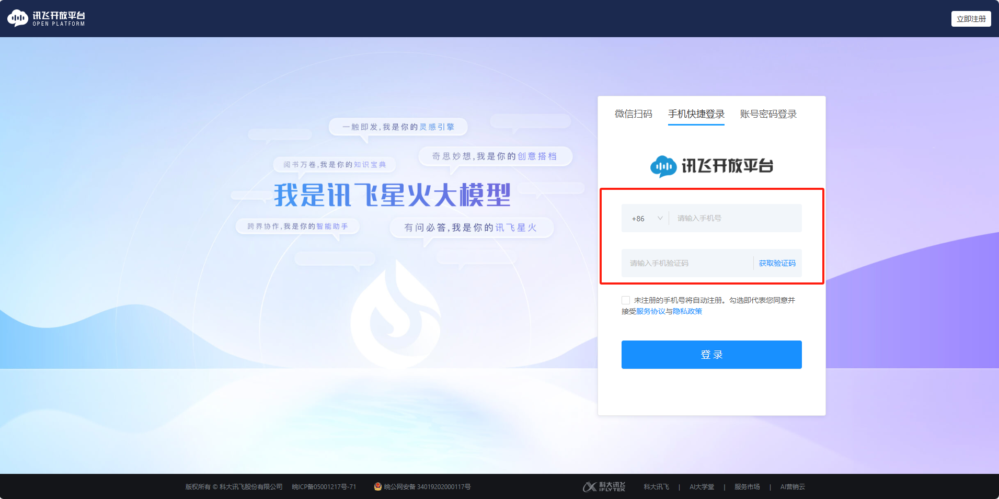
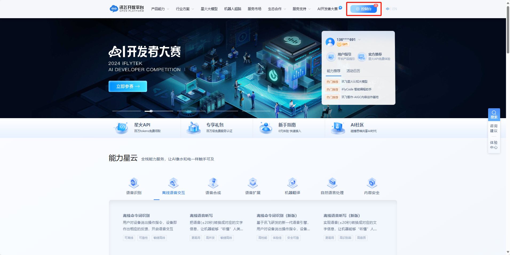
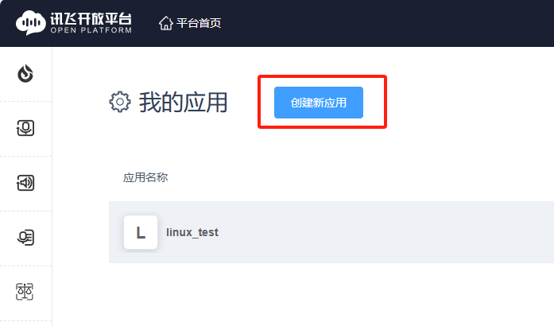
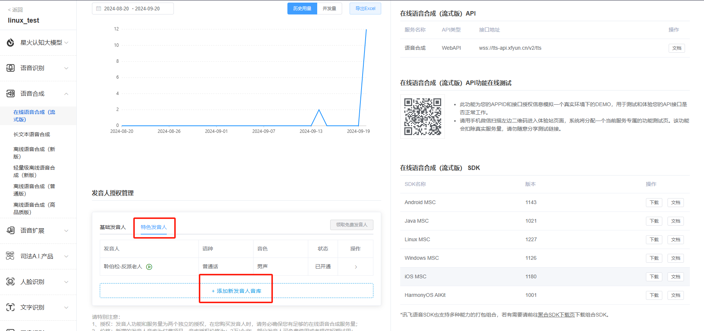
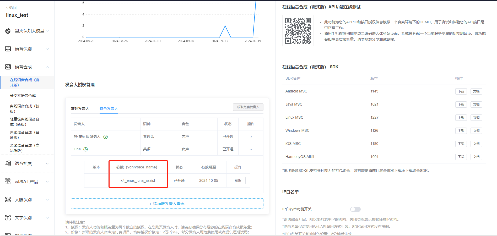
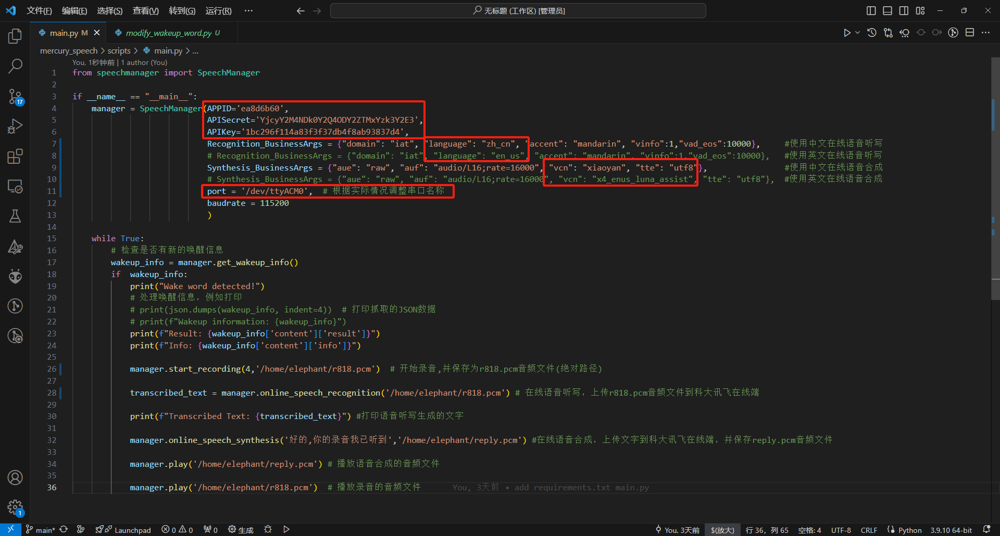
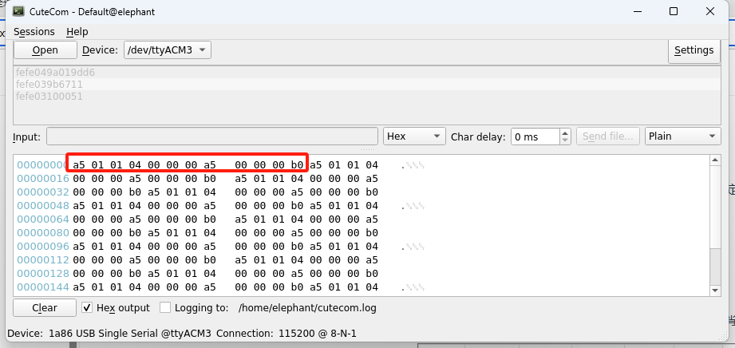
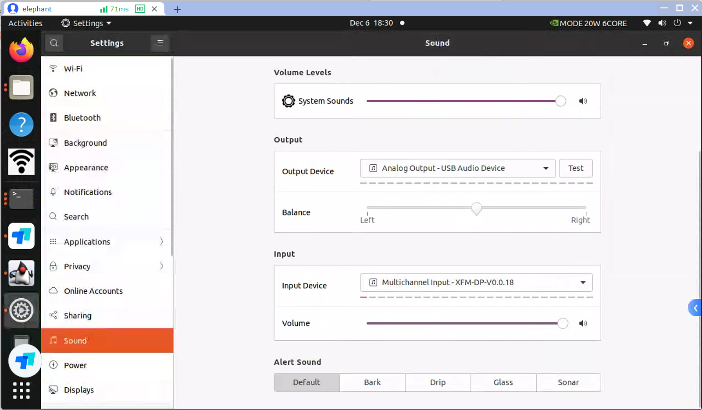
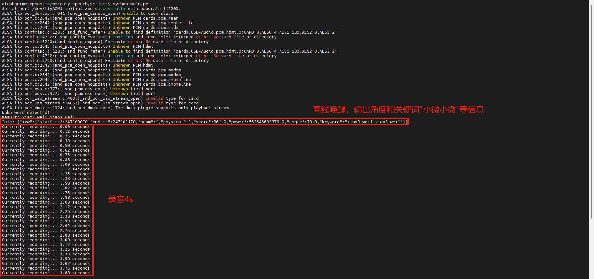

# Microphone Array


The M240 linear 4-microphone can pick up sound sources within a distance of 5m, with a sound source positioning angle of 0-180°, regardless of front and back, and a wake-up angle resolution of 5°.

The linear microphone array pickup picks up sound sources within a specified angle range through a fixed beam and suppresses the influence of sound sources at other angles. Fixed beam refers to the module using different pickup differences of the array microphones, and outputs a certain direction of audio through algorithm filtering. The beam pointing direction is only the pickup direction, and does not affect or change any information such as the angle when waking up. The beam diagram is shown below.


# github

[https://github.com/elephantrobotics/mercury_speech](https://github.com/elephantrobotics/mercury_speech)

# Code flow

Offline wake-up -> recording -> online voice dictation -> online speech synthesis -> play audio

Code running process: After running the python script, say the wake-up word (Xiaoxiaoxiaowei), start recording after hearing the wake-up word (default 4s), generate a .pcm audio file, and then upload the recording file to iFlytek online, and get the text output by voice dictation. At the same time, upload the text of the conversation to iFlytek online, synthesize the conversation audio and play it out.

Online voice dictation and online speech synthesis services need to be applied for by yourself.

# iFLYTEK Application

```
https://www.xfyun.cn/
```

Log in to the iFlytek open platform, register and log in as a user, and complete real-name authentication.




1.Find the console on the main page and click in.



2.In the upper left corner, find Create New App



3.Fill in the application name, application category and function description according to the requirements and submit


4.Return to My Apps and click on the app you just created.


5.Find the online voice dictation function, and the authorization information of the application is in the upper right corner.

It should be noted that: when the application is created, it is a trial version (free), and the service validity period of some functions of the application may vary from 30 days to 90 days. If the demand for service volume is large, you can purchase additional packages.

```
https://www.xfyun.cn/services/voicedictation
```


6.Apply for English speaker authorization for online speech synthesis. The speech synthesis applied for is also a trial version. If the demand for services is large, you can purchase additional packages.

```
https://www.xfyun.cn/services/online_tts
```






7.You need to obtain APPID, APISecret, APIKey, Chinese and English parameters, and speech synthesis audio parameters.

```
The SpeechManager class is used to manage speech-related functions, including speech wake-up, online speech recognition, online speech synthesis, recording, and playing PCM files.

Parameters:
- APPID: APPID of the application, used for API calls.
- APISecret: API secret key, used for authentication.
- APIKey: API key, used for API authorization.
- Recognition_BusinessArgs: Business parameters for online speech recognition, used to specify the behavior of recognition.
- Synthesis_BusinessArgs: Business parameters for online speech synthesis, used to specify the behavior of synthesis.
- port: Serial port number (default value is '/dev/ttyACM0'), used for offline wake-up function.
- baudrate: baud rate of the serial port (default value is 115200), used for serial communication of offline wake-up.
```



# Environment Construction

1.Pull code

```
git clone https://github.com/elephantrobotics/mercury_speech.git
```

2.Enter the following command in the terminal to install the dependent files.

```
sudo apt-get install portaudio19-dev python3-dev libportaudio2
```

```
cd ~/mercury_speech/
pip install -r requirement.txt
```

# Code Sample

1.Check which is the voice module serial port

Enter cutecom in the terminal, open the serial port assistant, and check the serial port device of ttyACM*

If /dev/ttyACM* permission denied appears, you can enter

```
sudo chmod 777 /dev/ttyACM*
```
If you don't want to do this every time you start the computer, you can enter the following command and change username to your own username.

```
sudo usermod -aG dialout username
```
The voice module will send a handshake request of "a5 01 01 04 00 00 00 a5 00 00 00 b0" every 500ms. Then ttyACM3 is the voice module.



2.Modify the main.py file terminal port serial port and save it.

3.Click the upper right corner of the desktop, find the system settings, and select the microphone and speaker devices.

The output device is: Analog Output - USB Audio Device

The input device is: Multichannel Input - XFM-DP-V0.0.18



4.Enter python main.py in the terminal to run.

```python
from speechmanager import SpeechManager

if __name__ == "__main__":
    manager = SpeechManager(APPID='ea8d6b60', 
                            APISecret='YjcyY2M4NDk0Y2Q4ODY2ZTMxYzk3Y2E3',
                            APIKey='1bc296f114a83f3f37db4f8ab93837d4',
                            Recognition_BusinessArgs = {"domain": "iat", "language": "zh_cn", "accent": "mandarin", "vinfo":1,"vad_eos":10000},     #使用中文在线语音听写
                            # Recognition_BusinessArgs = {"domain": "iat", "language": "en_us", "accent": "mandarin", "vinfo":1,"vad_eos":10000},   #使用英文在线语音听写
                            Synthesis_BusinessArgs = {"aue": "raw", "auf": "audio/L16;rate=16000", "vcn": "xiaoyan", "tte": "utf8"},                #使用中文在线语音合成
                            # Synthesis_BusinessArgs = {"aue": "raw", "auf": "audio/L16;rate=16000", "vcn": "x4_enus_luna_assist", "tte": "utf8"},  #使用英文在线语音合成
                            port = '/dev/ttyACM3',  # 根据实际情况调整串口名称
                            baudrate = 115200
                            )

    while True:
        # 检查是否有新的唤醒信息
        wakeup_info = manager.get_wakeup_info()
        if  wakeup_info:
            print("Wake word detected!")
            # 处理唤醒信息，例如打印
            # print(json.dumps(wakeup_info, indent=4))  # 打印抓取的JSON数据
            # print(f"Wakeup information: {wakeup_info}")
            print(f"Result: {wakeup_info['content']['result']}")
            print(f"Info: {wakeup_info['content']['info']}")

            manager.start_recording(4,'/home/elephant/r818.pcm')  # 开始录音4s,并保存为r818.pcm音频文件(绝对路径)

            transcribed_text = manager.online_speech_recognition('/home/elephant/r818.pcm') # 在线语音听写，上传r818.pcm音频文件到科大讯飞在线端

            print(f"Transcribed Text: {transcribed_text}") #打印语音听写生成的文字

            manager.online_speech_synthesis('好的,你的录音我已听到','/home/elephant/reply.pcm') #在线语音合成，上传文字到科大讯飞在线端，并保存reply.pcm音频文件

            manager.play('/home/elephant/reply.pcm') # 播放语音合成的音频文件

            manager.play('/home/elephant/r818.pcm')  # 播放录音的音频文件
```


# Operation effect




# Functional interface description

`online_speech_recognition(AudioFile)`

-  Online Speech Recognition

​    param AudioFile: Recording file path

​    return: Recognized text

`online_speech_synthesis(Text,pcm_file)`

- Online speech synthesis

​    param Text: Text to be synthesized

​    param pcm_file: The name of the file saved after synthesis

`play(filename)`

- Play the specified PCM file

  param filename: PCM file path

`start_recording(TIME, pcm_file)`

- Set recording parameters and verify the input recording duration

​    param TIME: The recording duration, in seconds, must be between 0 and 60 seconds (the default value is 4 seconds)

​    param pcm_file: The file name to save the recording to (the default file name is 'r818.pcm')

`get_wakeup_info()`

- Get the wake-up information. If there is new data, return the wake-up information and reset the event status.

​    return: wake_result