# Real-time Mapping Using Gampping

As a ROS robot, the control and implementation of motion is undoubtedly the most important part of the robot. Whether it is mapping or simple navigation, it needs to be realized through the movement of the base. In our base, the control and implementation of motion is realized through the communication between the upper computer and the lower computer, that is, the communication between ROS and STM32. The base moves by publishing the speed from ROS to STM32, and STM32 controls the motor speed according to the speed information. At the same time, the speed and posture of the base are obtained through the data returned by STM32 to ROS.

## 1.Prerequisites

The first step is to turn on the power switch and make sure the display screen of the contact head enters the system.

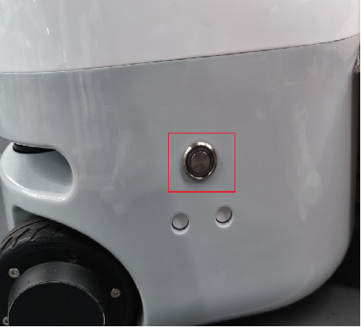


The second step is to make sure the emergency stop switch is on. If the emergency stop switch is not released, the arms and base cannot be controlled.

Releasing the emergency stop switch means releasing it clockwise. Pressing the emergency stop switch means disconnecting the power supply of the arms and base.


The third step is to turn on the emergency stop switch and observe the RGB light on the base. The purple flashing means low power and the base motor cannot be locked. At this time, plug in the power adapter for charging. The normal power is the blue, green and red RGB lights flashing in a cycle.


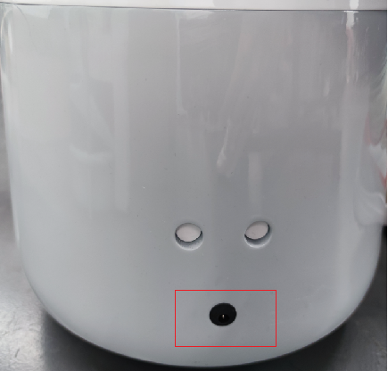


In the fourth step, you need to remove the screws at the tail and the left and right sides, and push back to open the back cover of the base.


Step 5. Connect the external wireless mouse and keyboard to the USB port of Mercury X1.

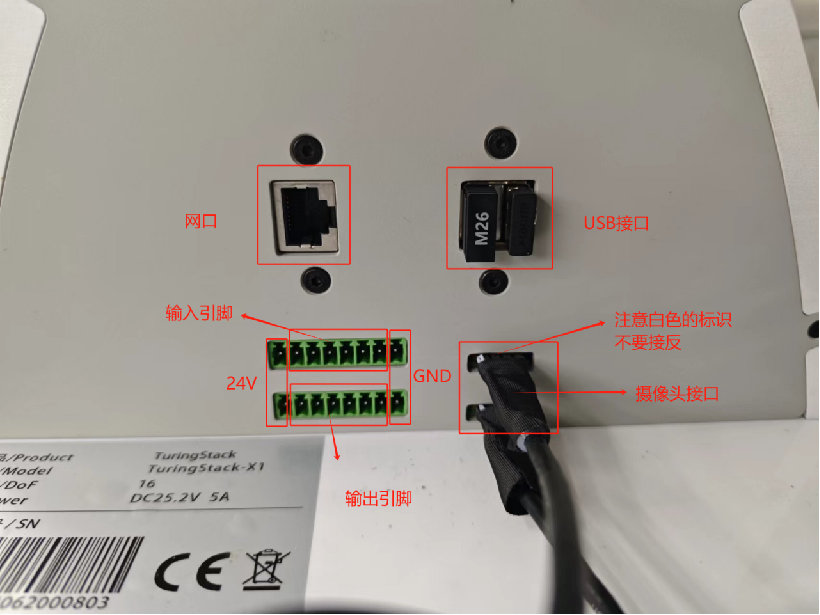

In addition to using an external mouse and keyboard to control Mercury X1, there are two other ways to operate Mercury X1.

Method 1: You can also operate Mercury X1 directly on the touch screen. In the area below the touch screen, press and hold and slide upward to pop up the virtual keyboard.

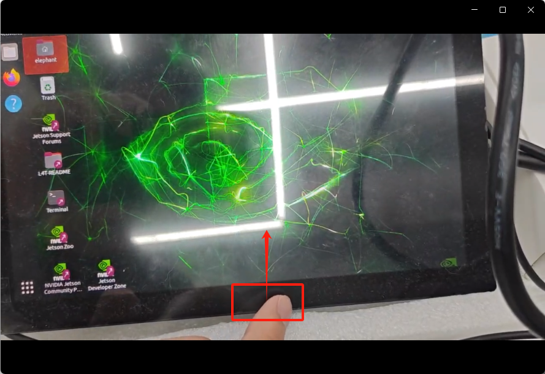

If the keyboard does not respond, press ⓧ twice to activate the keyboard. To hide the virtual keyboard, press the arrow keys.

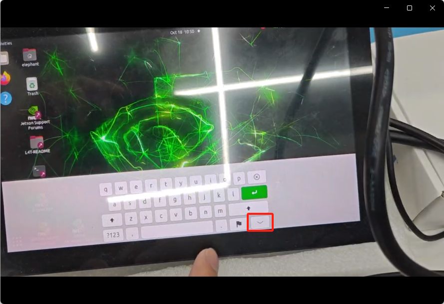

The second method is to use SSH login to connect remotely. SSH is a more reliable protocol designed to provide security for remote login sessions and other network services. Here we use the ssh remote connection hardware device provided by [MobaXterm free Xserver and tabbed SSH client for Windows (mobatek.net)](https://mobaxterm.mobatek.net/).

Open the base, enter the graphical interface, connect the base to WiFi, open Terminal to enter the terminal interface (press Ctrl+Alt+T on the keyboard), and enter the ifconfig command to view the current IP address:

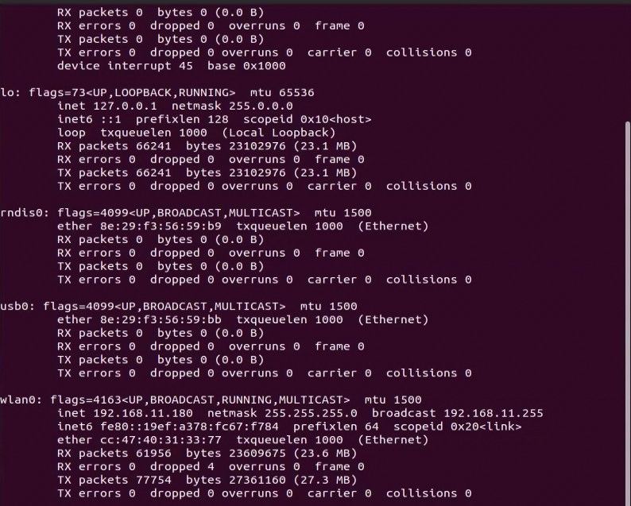

wlan0/wlan1 indicates the wireless interface. Simply put, when you connect to a wireless network, this interface IP will be called to connect.

At this time, the base is connected to a wireless network, so an IP address appears in the wlan0 module. Next, you can use this IP to connect. Of course, this IP is not fixed, it is related to your current network IP.

On your computer, connect to the same wifi as mercury x1 to use the ssh function of mobaxterm. Click the Session icon, enter the x1's ip, click OK, and click Accept for the first connection.


Username: **elephant**
Password: **Elephant**

Enter the username: elephant Enter the password: elephant. The password will not be displayed when you enter it. Enter it normally and press Enter to log in.

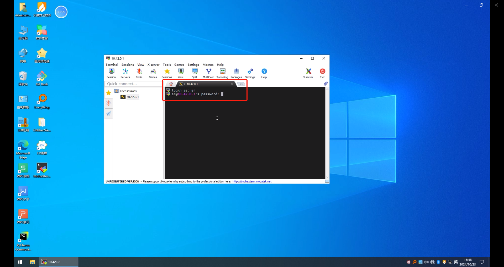

The normal login screen is displayed. This terminal can be used to type commands to remotely control mercury x1

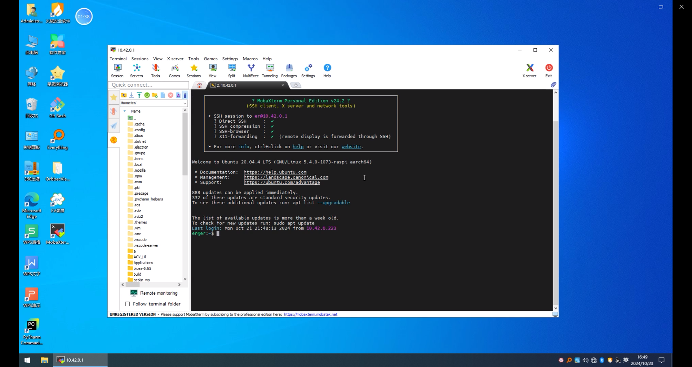

## 2.Start communication with the base

In our ROS source code, we usually use the launch file to start a node, and the start of the base motion initialization node is implemented by the turn_on_mercury_robot.launch file under the turn_on_mercury_robot function package path. The startup instructions are as follows:

```
roslaunch turn_on_mercury_robot turn_on_mercury_robot.launch
```

This launch file must be started to realize the communication between ROS and STM32 and the base can move. Except for the launch files for keyboard control and wireless handle control, the launch files for other functions are nested and run to start the initialization node. There is no need to run the turn_on_mercury_robot.launch file of the underlying node again. If it is called repeatedly, an error will be reported.

The turn_on_mercury_robot.launch file consists of five parts: 1. Car parameter settings; 2. Start the underlying MCU control node; 3. Navigation local path planning algorithm selection; 4. Release the TF relationship and car shape visualization for mapping and navigation; 5. Start the ekf extended Kalman filter algorithm.


## 3.Open the Gampping map launch file

```
roslaunch turn_on_mercury_robot mapping.launch
```

```
roslaunch turn_on_mercury_robot slider_control.launch
```

```
roslaunch mercury_x1_teleop keyboard_teleop.launch
```
One thing to note is that when running mapping.launch, turn_on_mercury_robot.launch is included. There is no need to start the turn_on_mercury_robot.launch file separately. If you start it again, it will conflict and cause an error.


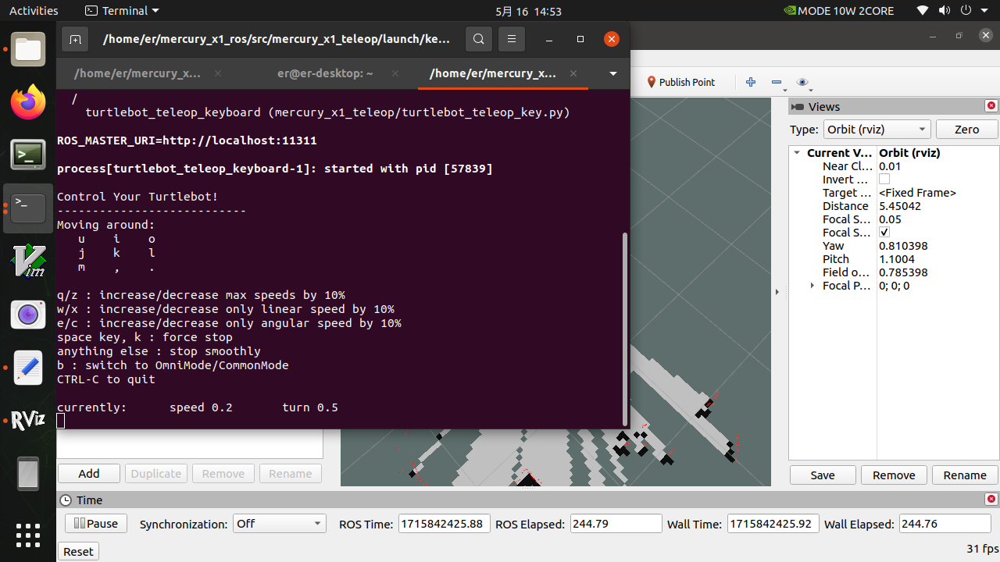

At this point, you can control the movement of the car through the keyboard. Press the keys according to the terminal prompts to control the movement, steering, and speed of the car.

| Button | Direction |
| ---- | ------------------ |
| i | Forward |
| , | Backward |
| j | Rotate counterclockwise |
| l | Rotate clockwise |
| u | Move left |
| o | Move right |
| k | Stop |
| m | Move clockwise backward |
| . | Move counterclockwise backward |
| q | Increase linear and angular velocity |
| z | Decrease linear and angular velocity |
| w | Increase linear velocity only |
| x | Decrease linear velocity only |
| e | Increase angular velocity only |
| c | Decrease angular velocity only |

## 4.Start building a map

Now, mercury x1 can start moving under keyboard control. Manipulate mercury x1 to rotate within the desired mapping space. At the same time, you can observe in Rviz space that as x1 moves, our map is gradually built.

Note: When using the keyboard to operate x1, make sure that the terminal running the keyboard_teleop.launch file is the currently selected terminal; otherwise, the keyboard control program will not recognize the keystrokes. In addition, in order to obtain better mapping effects, it is recommended to set the linear velocity to 0.15 and the angular velocity to 0.4 when controlling with the keyboard, because lower speeds tend to produce better mapping effects. 


## 5.Save the constructed map

After moving within a certain range, a relatively complete 2D map can be built. The continuous red dots that appear during the map building process are obstacles detected by the lidar in real time, while the black dots are the obstacle boundaries determined by the radar.

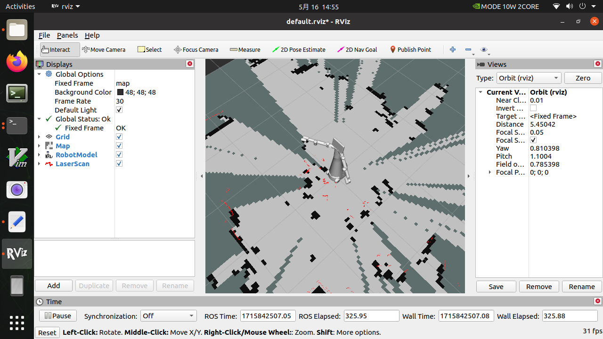

Map parameter files are placed in the same folder as much as possible for easy management, so we put them in the following path

```
cd mercury_x1_ros/src/turn_onmercury_robot/map
```

Then enter the following command to save the current raster map, and then we will generate the map parameter files map.yaml and map.pgm in the current path (mercury_x1_ros/src/turn_onmercury_robot/map)

```
rosrun map_server map_saver
```

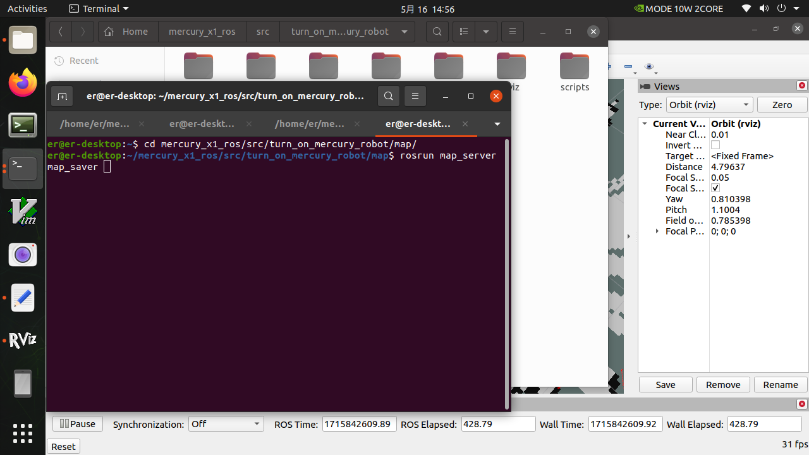

Of course, we can add the parameter -f at the end to add a suffix to the map parameter file

```
rosrun map_server map_saver -f map_demo_505
```

In this way, we will generate map parameter files of map_demo_505.yaml and map_demo_505.pgm in the current path. The advantage of adding suffixes is that it is easy to manage the maps you need and avoid overwriting the map files that you have worked hard to build before.

After saving, you can view the image format of the saved map in the path /home/er/mercury_x1_ros/src/turn_on_mercury_robot/map, which is in pgm format.

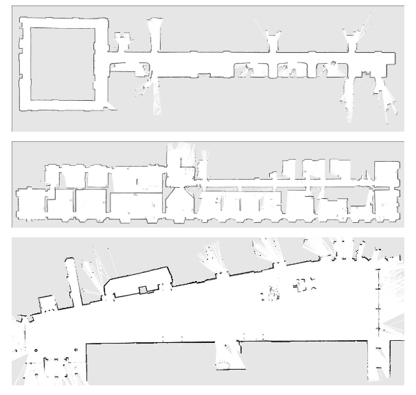

