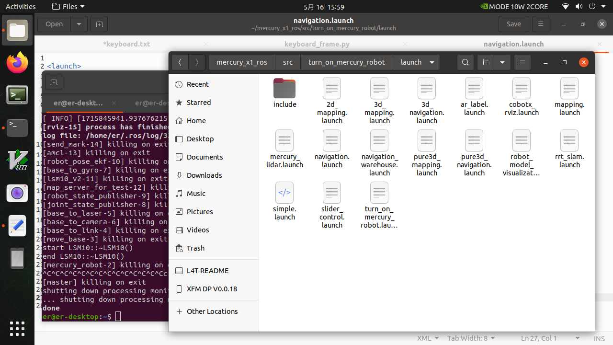
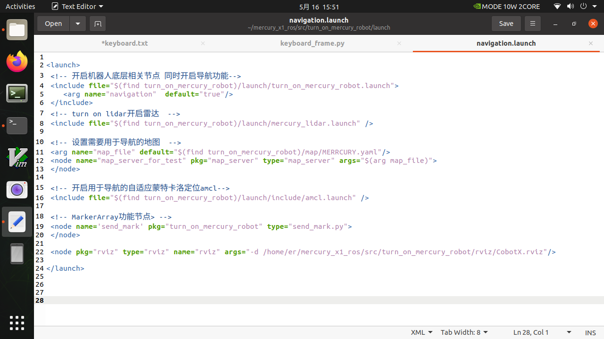
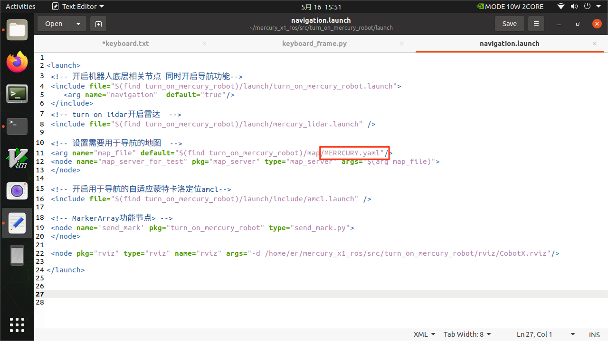
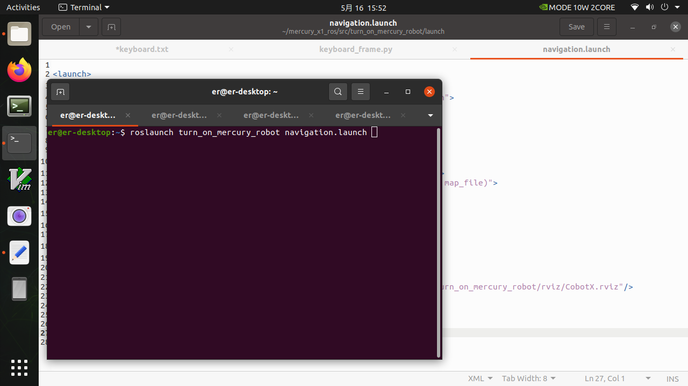
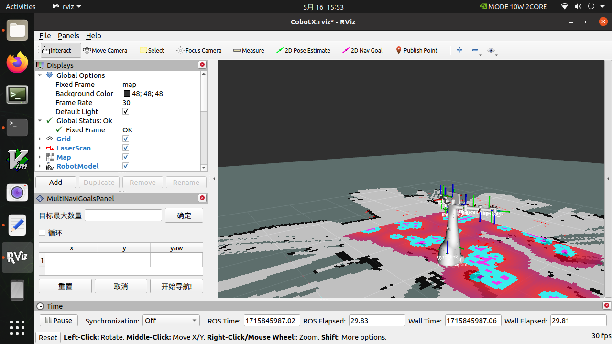
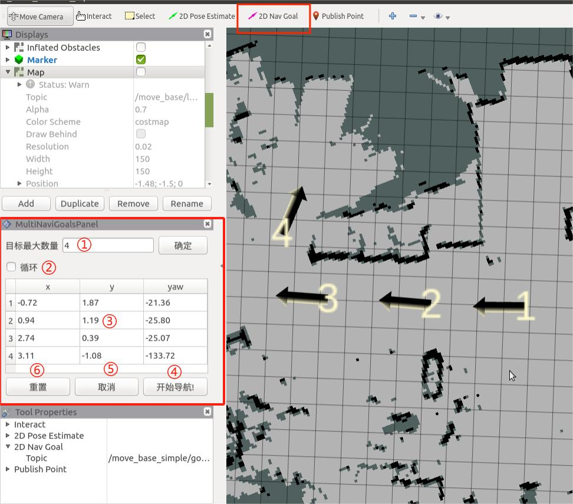
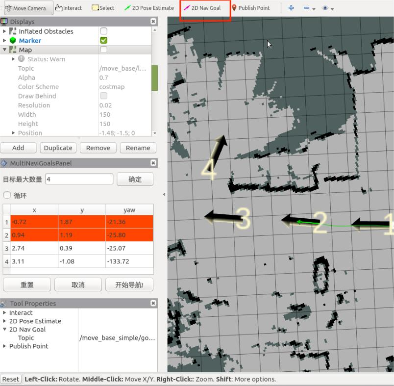
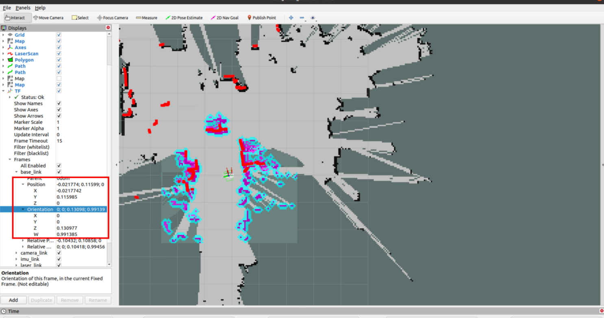

# Navigation

1. In the path of mercury_x1_ros/src/turn_on_mercury_robot/launch, find the navigation.launch file and right-click to open and edit the file.





2. Set the map you need for navigation

Find the 11th line, which is the line that imports the map parameter file you use for navigation.

```
<arg name="map_file" default="$(find turn_on_mercury_robot)/map/MERRCURY.yaml"/>
```



I use the parameter file MERCURY.yaml for navigation here, of course you can also change it to the parameter file you want to navigate.

For example, in the gmapping process, I generate map_demo_505.yaml in the path mercury_x1_ros/src/turn_onmercury_robot/map, and I need to use it for navigation, so I have to change it like this.

```
 <arg name="map_file" default="$(find turn_on_mercury_robot)/map/map_demo_505.yaml"/>
```

3. Start the roslaunch navigation file

Make sure your other terminal programs are closed, then open a new terminal and execute the following command

```
roslaunch turn_on_mercury_robot navigation.launch
```




4. An rviz visualization interface will automatically open, and the robot's default position is the starting point of the map.




You can click 2D Nav Goal to send the navigation target point


Understand the navigation operation area in the lower left corner

>① Maximum number of target points that can be set: The number of target points set cannot be greater than this parameter (can be less than)
>
>② Whether to loop: If checked, after navigating to the last target point, it will navigate to the first target point again. Example: 1->2->3->1->2->3->···, this option must be checked before starting navigation
>
>③ Task target point list: x/y/yaw, the position and posture of the given target point on the map (xy coordinates and heading angle yaw).
>
>- After setting the maximum number of targets and saving, the list will generate the corresponding number of entries
>- For each target point given, the coordinates and orientation of the target point will be read here
>
>④ Start navigation: Start the task
>
>⑤ Cancel: Cancel the navigation task of the current target point, and the robot stops moving. After clicking Start navigation again, it will start from the next task point.
>
>Example: 1->2->3, click Cancel during the process of 1->2, the robot stops moving, and after clicking Start navigation, the robot will go from the current coordinate point to 3.
>
>⑥ Reset: All current target points will be cleared




Set the number of task target points and click OK to save. Then click 2D Nav Goal on the ToolBar to set the target point on the map. (You need to click 2D Nav Goal before setting each time). The target points are distinguished by direction, and the top of the arrow is the robot's forward direction. Click Start Navigation, and navigation begins. In rviz, you can see that there is a global planning path for the robot between the starting point and the target point, and the robot will move along the route to the target point.



- Write a simple python to send navigation points

```python
import sys
import rospy
import actionlib

from move_base_msgs.msg import MoveBaseAction, MoveBaseGoal
from actionlib_msgs.msg import *
from geometry_msgs.msg import Point
from geometry_msgs.msg import Twist

class MapNavigation:
    def __init__(self):
        self.goalReached = None
        rospy.init_node('map_navigation', anonymous=False)

    # move_base
    def moveToGoal(self, xGoal, yGoal, orientation_z, orientation_w):
        ac = actionlib.SimpleActionClient("move_base", MoveBaseAction)
        while (not ac.wait_for_server(rospy.Duration.from_sec(5.0))):
            sys.exit(0)

        goal = MoveBaseGoal()
        goal.target_pose.header.frame_id = "map"
        goal.target_pose.header.stamp = rospy.Time.now()
        goal.target_pose.pose.position = Point(xGoal, yGoal, 0)
        goal.target_pose.pose.orientation.x = 0.0
        goal.target_pose.pose.orientation.y = 0.0
        goal.target_pose.pose.orientation.z = orientation_z
        goal.target_pose.pose.orientation.w = orientation_w

        rospy.loginfo("Sending goal location ...")
        ac.send_goal(goal)

        ac.wait_for_result(rospy.Duration(600))

        if (ac.get_state() == GoalStatus.SUCCEEDED):
            rospy.loginfo("You have reached the destination")
            return True
        else:
            rospy.loginfo("The robot failed to reach the destination")
            return False

if __name__ == "__main__":
    goal_1 = [(-0.0277661, -0.00824622, 0.0431145, 0.999068)]   
    goal_2 = [(0.428357, -1.99509, 0.999547, -0.037365)]     
    goal_3 = [(0.318357, -2.10509, -0.681143, 0.732115)]     
    goal_4 = [(1.88323, -1.84847, 0.0746518, 0.997171)]     
    goal_5 = [(2.05847, -0.492321, -0.00194264, 0.999828)]  
    map_navigation = MapNavigation()

    x_goal, y_goal, orientation_z, orientation_w = goal_2[0]
    flag_feed_goalReached = map_navigation.moveToGoal(x_goal, y_goal, orientation_z, orientation_w)
    if flag_feed_goalReached:
        print("command completed")
    else:
        raise ValueError    
```

The code above focuses on obtaining each goal_x, which can be obtained by the following operations. Make sure that your other terminal programs are closed, then open a new terminal and execute the following command

```
roslaunch turn_on_mercury_robot navigation.launch
```

Then use the keyboard to control the robot to the navigation point you need.

```
roslaunch mercury_x1_teleop keyboard_teleop.launch
```

In rviz, click Add in the lower left corner, find the By display type column, select TF and click OK


Find the Position and Orientation columns in Frames->base_link. This is the TF conversion of the current base_link relative to the map. Record the X/Y of Position and the Z/W of Orientation, and give them to the goal_1 variable in the Python code. After sending the change to move_base, it will start navigating to that point.


And so on, use the keyboard to control to the second point and record the second position goal_2

