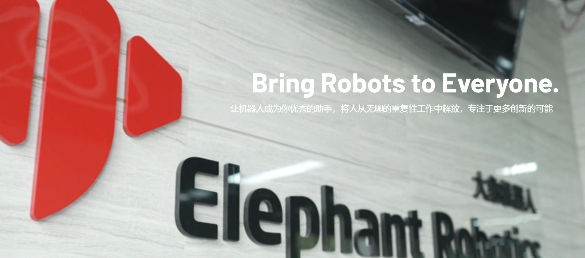
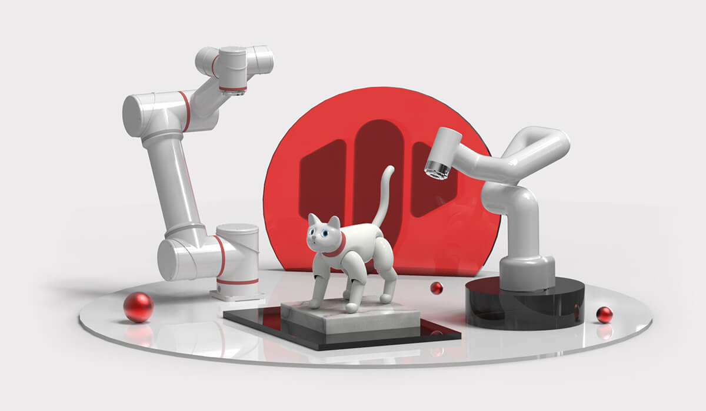

# ElephantRobot

## 1 Company Profile

&nbsp;&nbsp;&nbsp;&nbsp;&nbsp;&nbsp;Shenzhen Elephant Robotics Technology Company Limited, established on August 10, 2016, is a Chinese high-tech enterprise specializing in robot R&D and production, platform software development, and intelligent manufacturing services. The company boasts an international perspective, with its core team comprised of professionals who have studied abroad in the UK, US, and Australia. We have established joint laboratories with universities such as the University of Melbourne, the Russian State Research University of Nuclear Energy, and South China University of Technology to jointly tackle technical challenges and develop collaborative robot solutions covering educational to professional levels. Since its inception, the company has been incubated by the global hardware incubator HAX and has subsequently received investment from leading funds such as Cloud Angel, SOSV, Orient Securities, Shenzhen Capital Group, ZhenFund, and GigaDevice, driving rapid growth in its global business. Our vision is "Enjoy Robots World," aiming to bring fun and increased efficiency to people's lives and work through our robotic products. Our self-developed product line includes consumer-grade collaborative robots (myCobot/mechArm/ultraArm/myPalletizer/myBuddy/myArm/myController/myAGV), biomimetic companion robots (MarsCat/metaCat/metaDog/metaPanda), professional-grade collaborative robots (Panda/Catbot/myCobot Pro and articulated modules), and humanoid robots (Mercury). These products are widely used in smart manufacturing, commercial applications, scientific research and education, and home life.  

&nbsp;&nbsp;&nbsp;&nbsp;&nbsp;&nbsp;Elephant Robotics' products have won global market recognition for their superior quality and intelligent solutions, especially in core markets such as China, the UK, the US, Germany, France, and Japan. Looking to the future, we will continue to leverage cutting-edge technology to drive the development of the robotics industry, working together with customers and partners to usher in a new era of automation and intelligence.

&nbsp;&nbsp;&nbsp;&nbsp;&nbsp;&nbsp;Suzhou Hummingbird Robotics Technology Co., Ltd., established on March 7, 2025, is a wholly-owned subsidiary of Shenzhen Elephant Robotics Technology Co., Ltd. Hummingbird Robotics focuses on the R&D, manufacturing, and sales of desktop industrial robots' hardware and software, aiming to provide enterprises with high-precision, low-cost, and rapidly deployable automation solutions. Leveraging its parent company's technological expertise and industrialization advantages in the robotics field, and supported by a comprehensive R&D system and agile supply chain, Hummingbird Robotics provides high-quality solutions for customers in industries such as electronics manufacturing, metal processing, and packaging logistics, with desktop lightweight robotic arms as its core product. This effectively helps customer companies improve industrial efficiency and achieve intelligent upgrades.

## 2 Development Process

2016.08 ----- Elephant Robot Co., Ltd. was officially established.

2016.08 ----- Entered HAX incubator and obtained SOSV seed round investment.

2016.08 ----- Started developing Elephant S industrial collaborative robot.

2017.01 ----- Awarded "Top 10 Most Innovative Companies in China at CES."

2017.04 ----- Attended Hannover Industrial Fair and Korea Automation Exhibition.

2017.07 ----- The two founders were selected as "30 Business Elites Under 30" by Forbes Asia.

2017.10 ----- Launched the fifth generation single-arm industrial collaborative robot Elephant S.

2018.04 ----- Obtained angel round investment from "Cloud Angel Fund."

2018.06 ----- First public appearance at the 2018 Hannover World Industrial Fair.

2018.06 ----- Received the "Intelligent Manufacturing Entrepreneurship MBA Award" from Cheung Kong Graduate School of Business.

2018.06 ----- Received the "X-elerator Award" from Tsinghua SEM.

2018.11 ----- Won second place in the Shenzhen Division of the Asian Intelligent Hardware Competition.

2018.11 ----- Won the "Most Investment Enterprise Award" at the Golden Globe Award.

2019.03 ----- Won the "Leadership Award" at the Golden Globe Award.

2019.04 ----- March 2019 Catbot won the "Industrial Robot Innovation Award."

2019.09 ----- Attended Huawei European Ecosystem Conference (HCE) and officially became a member of Huawei’s ecological partners.

2019.11 ----- Elephant Robot and Harbin Institute of Technology attended the IROS International Intelligent Robots and Systems Conference.

2019.12 ----- Elephant Robot-South China University of Technology's "Intelligent Robot Joint Development Laboratory" was officially unveiled.

2019.12 ----- Won the 2019 "Innovation Technology Award" from Gaogong.

2019.12 ----- Won the "Top Ten Fast-Growing Enterprises" of Gaogong in 2019.

2019.12 ----- Won the Shenzhen Equipment Industry-Industrial Robot Segment-"New Enterprise Award."

2019.12 ----- Launched the world’s first bionic robotic cat, MarsCat.

2020.05 ----- The founder won the 2019 Shenzhen Robot Emerging Figure Award.

2020.10 ----- Launched myCobot, the world’s lightest and smallest six-axis collaborative robot.

2021.03 ----- Launched myCobotPro 320, the smallest collaborative robot for scientific research.

2021.05 ----- MarsCat received competing reports from Xinhua Finance, China Daily, Nanjing Daily, Harbin Daily, and other media.

2021.07 ----- Released the smallest composite robot chassis – the little elephant mobile robot myAGV.

2021.09 ----- Launched the world's first fully wrapped four-axis robotic arm - the little elephant palletizing robotic arm myPalletizer.

2022.01 ----- Obtained a series of reports from 36 Chlorine and Geek Park on the role of Elephant Robot in the light consumer robot industry.

2022.02 ----- MarsCat and myCobot appeared in the Spring Festival Gala live video broadcast and participated in Shenzhen Satellite TV’s special New Year program.

2022.05 ----- Launched the most compact small six-axis robotic arm mechArm, capable of artificial intelligence robot education.

2022.06 ----- Combined with Unity engine, based on myCobot robot, launched artificial intelligence robot practical introduction book + books (international courses).

2022.07 ----- Released metaCat, a simulation companion robot cat in the artificial intelligence era.

2022.07 ----- Released mybuddy, the smallest dual-arm collaborative robot in history.

2022.08 ----- Won the "Top Ten Non-Industrial Technology Innovation Awards."

2022.08 ----- The founder won the "2022 Shenzhen Robot Emerging Figure Award."

2022.11 ----- First runner-up in iFLYTEK AI Developer Competition real-time engagement (real-time interaction) track.

2022.11 ----- Best Robot Award at 2022 World Acoustic Expo 1024 Science and Technology Expo.

2022.12 ----- CCTV report.

### 【Funding Track】

August 2016 ----- Shenzhen Elephant Robotics Technology Co., Ltd. was officially established.

August 2016 ----- Entered HAX Incubator and received seed round investment from SOSV.

October 2017 ----- Received angel round investment from Yun Angel Fund.

February 2019 ----- Received Pre-A round investment from Dongfang Hongtai Fund.

November 2021 ----- Received Series A investment from ZhenFund and Shenzhen Capital Group Sosford.

December 2023 ----- Received Series A+ investment from Qinghui Yide and Shanghai Hongchong.

April 2024 ----- Received Series A++ investment from Qinghui Yide.

### 【Qualification Track】

July 2021 ----- Awarded the title of Technology-based SME.

December 2021 ----- Obtained the "National High-tech Enterprise" qualification certificate.

December 2022 ----- Awarded the title of Innovative SME.

April 2023 ----- Obtained "Specialized, Refined, Unique, and Innovative" Enterprise Certification

October 2023 ----- Obtained Export Commodity Brand Certificate

August 2025 ----- Passed ISO9001:2015 Quality Management System Certification

### 【Product Line】

July 2017 ----- Launch of the fifth-generation single-arm industrial collaborative robot, Elephant S

May 2018 ----- Mass production of Elephant S officially begins

December 2018 ----- Launch of the industrial collaborative robot, Panda

January 2019 ----- Launch of the industrial collaborative robot, Catbot

December 2019 ----- Launch of the world's first bionic robotic cat, MarsCat

August 2020 ----- Launch of the world's lightest and smallest six-axis collaborative robot, myCobot

March 2021 ----- Launch of the smallest commercially available collaborative robot, myCobot Pro 320

July 2021 ----- Release of the smallest composite robot chassis, the elephant-shaped mobile robot, myAGV

September 2021 ----- Release of the lightweight four-axis robotic arm, myPalletizer

January 2022 ----- Bionic robotic cat, MarsCat Mass production officially begins.

May 2022 ----- The most compact six-axis robotic arm, mechArm, is launched, empowering AI robotics education.

June 2022 ----- In collaboration with iFlytek AI Classroom, a training course on the basic principles of robotics was created.

June 2022 ----- In collaboration with the Unity engine, an introductory book on AI robotics practice (international course) based on the myCobot robot was launched.

July 2022 ----- The AI-era companion robot cat, metaCat, was released.

July 2022 ----- The smallest dual-arm collaborative robot in history, myBuddy, was released.

January 2023 ----- The desktop-grade high-precision robotic arm, ultraArm, was launched.

February 2023 ----- The 2023 version of the AI ​​kit, a holistic solution based on vision recognition and robotic arms, was released.

March 2023 ----- The world's smallest six-axis collaborative robot, myCobot 280, was newly upgraded.

June 2023 ----- The myCobot AI kit... Version 320 Launched

July 2023 ----- 3D AI Kit Launched

August 2023 ----- The World's Smallest 7DOF Collaborative Robotic Arm, myArm, Launched

November 2023 ----- Intelligent Mobile Chassis, myAGV, Completely Upgraded for 2023

December 2023 ----- Mercury Series Humanoid Robots, Priced at Tens of Thousands of Yuan, Launched

April 2024 ----- Elephant Planet, metaDog, Officially Launched

April 2024 ----- Professional Commercial Robotic Arm, myCobot 630, Completely Iterated

April 2024 ----- myArm M&C Intelligent Teleoperated Robotic Arm Combination Launched

May 2024 ----- Mass Delivery of Humanoid Robots Achieved

July 2024 ----- Release of the meta series companion robot, metaPanda

September 2024 ----- Release of myCobot Pro 630 Mobile Composite Robot Kits

November 2024 ----- Release myGripper F100 Force-Controlled Gripper

December 2024 ----- Release myController S570 Exoskeleton Controller

January 2025 ----- Release myGripper H100 Three-Finger Force-Controlled Dexterous Hand

March 2025 ----- Release myCobot Pro 630 3D Vision Sorting Kit

March 2025 ----- Release Composite Robot Smart Logistics Kit

April 2025 ----- Release myCobot 280 Vision Palletizing Kit

### 【Honors】

2017.01 ----- Ranked among the Top 10 Most Innovative Companies in China at CES

2017.04 ----- Two founders selected as one of Forbes Asia's "30 Under 30" business leaders

2018.06 ----- Received the Cheung Kong Graduate School of Business Smart Manufacturing Entrepreneurship MBA Award

2018.06 ----- Received the Tsinghua University School of Economics and Management X-elerator Award

2018.06 ----- Ranked second in the Shenzhen division of the Asia Smart Hardware Competition

2018.11 ----- Received the Gaogong Golden Globe Award for Most Investable Company

2018.11 ----- Received the Gaogong Golden Globe Award for Leading Technological Figure

2019.01 ----- Catbot received the Industrial Robot Innovation Award from the Industrial Control Network

2019.09 ----- Became a Huawei ecosystem partner and Huawei HCE partner

2019.12 ----- The "Elephant Robotics-South China University of Technology Intelligent Robotics Joint Development Laboratory" was officially established.

December 2019 ----- Received the 2019 Top Ten Fastest Growing Enterprises Award from the High-Tech Golden Globe Awards.

December 2019 ----- Received the 2019 Innovative Technology Award from the High-Tech Golden Globe Awards.

December 2019 ----- Received the Shenzhen Equipment Industry Industrial Robotics Sub-Sector Emerging Enterprise Award.

May 2020 ----- Founder received the 2019 Shenzhen Robotics Emerging Figure Award.

November 2021 ----- Received the Most Investable Enterprise Award at the 10th China (Shenzhen) Overseas Returnees Entrepreneurship Conference.

December 2021 ----- Founder received the "iMB Greater Bay Area Future Hard Innovation Star" Award and shared outstanding enterprise experiences.

December 2021 ----- Received the Third Prize in the Finals of the 5th China Electronics "i+" Innovation and Entrepreneurship Competition.

August 2022 ----- Received "Top Ten Non-Industrial Technology Innovation Award"

August 2022 ----- Founder received "2022 Shenzhen Robotics Emerging Talent Award"

November 2022 ----- Runner-up in the Real-Time Engagement track of the iFlytek AI Developer Competition

November 2022 ----- Best Robot Award at the 2022 World Voice Expo 1024 Science and Technology Exhibition

June 2023 ----- Received donation certificates from multiple special needs children's rehabilitation centers

June 2023 ----- Featured in the first batch of Shenzhen Intelligent Robot Application Demonstration Typical Cases

September 2023 ----- Received a "Letter of Appreciation from the Organization Department of the Shenzhen Municipal Committee"

September 2023 ----- Second Prize in the 5th China Chip Competition Finals

October 2023 ----- Received the "High-end Manufacturing Excellent Enterprise Award"

October 2023 ----- Received the "Excellent Enterprise Award" from Maker China

November 2023 ----- 2023.12 - Received the Leaderobot 2023 Annual Robotics Industry Scientific Research Contribution Award

2023.12 ----- Ranked in the Top 50 Most Investable Robotics Companies of the Year

2023.12 ----- Received the Second Prize in the First National Advanced Computing Technology Innovation Competition

2024.01 ----- Selected as a Sino-Korean Innovation and Entrepreneurship Mentor iCK30·30 M30

2024.03 ----- Received the Shenzhen Federation of Industry and Commerce Guangdong-Hong Kong-Macao Greater Bay Area Enterprise Innovation Power List - Future Creation Star List

2024.04 ----- Received the Leaderobot 2024 Annual China Humanoid Robot Industry Selection - Humanoid Robot Application Benchmark Award

2024.04 ----- Received the Vico.com 2024 China Robotics Industry Conference Annual Figure of the Year and Annual Innovative Product Award

2025.01 ----- CEO Song Junyi received the Shenzhen Robotics Association's SRA 2024 Annual Robotics Industry New Generation Leader Award

March 2025 ----- The meta series was selected as a Shenzhen souvenir.

April 2025 ----- Mercury X1 won the Innovation Award at the 13th China Electronics Information Expo.

April 2025 ----- CEO Song Junyi received the OFweek 2024 China Robotics Industry Annual Influential Person Award.

August 2025 ----- Awarded the title of "New Quality Productivity Emerging Enterprise" by the Futian District New Social Stratum Association.

November 2025 ----- CEO Song Junyi participated in the 2025 Futian District Talent Day and Entrepreneur Day activities and received the title of "Industry Pioneer".

December 2025 ----- Received the 2025 Shenzhen Robotics Application Typical Case Award.

December 2025 ----- Received the AIC Artificial Intelligence Leaders Conference 2025 Most Investable New Quality Driving Force Award.

December 2025 ----- Selected as one of LeadeRobot's 2025 Top 50 Rising Stars in China's Embodied Intelligence Era

December 2025 ----- meta Panda and robot joint modules selected for Huaqiangbei Liubao

### 【Major News Highlights】

May 2021 ----- MarsCat, the bionic cat, received extensive media coverage, including Xinhua Finance, China Daily, Nanjing Daily, and Harbin Daily.

January 2022 ----- Featured in a series of reports by 36Kr and GeekPark on Elephant Robotics' work in the lightweight consumer robot industry.

February 2022 ----- MarsCat and myCobot appeared on CCTV's Spring Festival Gala live stream and participated in Shenzhen TV's Spring Festival special program.

January 2023 ----- Featured on CCTV News' "Walking Towards Spring | Late Night in Huaqiangbei"

February 2023 ----- Microsoft successfully conducted ChatGPT for Robotics experiments using the Elephant myCobot 280 robotic arm.

March 2023 ----- IEEE Spectrum reported on Elephant Robotics' academic development solutions.

July 2023 ----- Featured in Shenzhen Business Daily's article "Collaborative Robots, Born for Companionship". Special Report: "An Elephant Emerges from Huaqiangbei"

December 2023 ----- Raspberry Pi official magazine MagPi Issue 137 published a review article on the myCobot 280 desktop six-axis collaborative robotic arm.

January 2024 ----- Featured in Southern Finance's "High-Growth Enterprises" column.

March 2024 ----- Featured on CCTV Finance Channel's "One-Stop Access to the Tide Delta" program.

March 2024 ----- Featured in Hong Kong's Jingbao Daily's article, "The Elephant's Expedition: Starting from Huaqiangbei."

April 2024 ----- Featured by Intel RealSense.

July 2024 ----- Featured on the front page of the IEEE Robotics Platform homepage.

July 2024 ----- Featured in Southern Finance's Guangdong Industrial Economy Semi-Annual Report.

January 2025 ----- Featured on KSNV (News 3) television in Las Vegas, USA.

January 2025 ----- Mita series pet robots receive extensive coverage from tech media outlets including Interesting Engineering, CBN, Shenzhen Special Zone Daily, and Shenzhen Daily.

February 2025 ----- Featured in a video report on the company's development by the Huaqiangbei Museum.

February 2025 ----- Mita series robots featured in a report by Shenzhen Evening News.

February 2025 ----- Featured on the Futian District Publicity Department's "Happy Futian" WeChat official account, showcasing lightweight desktop robots and the company's development history.

April 2025 ----- Featured in official coverage of the CITE (China International Electronics Information Expo) for the "Mita" series of robots.

April 2025 ----- Featured in a series of reports on Huaqiangbei by CCTV News Channel's "Oriental Horizon" program: "Industrial Transformation in Guangdong: Robot Companies Stepping Out of the 'Cubicle' and Building a Large Market."

May 2025 ----- Mita series robots featured in a special report by CCTV Finance Channel's "Economic Half Hour" program.

May 2025 ----- Featured in a thematic report on the Canton Fair by CBN.

May 2025 ----- Featured in a report by tech media outlet Interesting Engineering. Engineering Special Report: metaCat and Australian Social Welfare

August 2025 ----- Covered by CCTV, Xinhua News Agency, Guangzhou Daily, Global Times, China News Network, and other media outlets, highlighting the company's participation in the World Robot Conference.

November 2025 ----- Interview with the company by Southern Metropolis Daily regarding the company's entrepreneurial journey.

November 2025 ----- Live broadcast by CCTV's "News Live Room" showcasing the Suzhou Embossed Intelligent Robot Comprehensive Innovation Center – Mercury X1.

January 2026 ----- Covered by Shenzhen Business Daily (DuChuang), Southern Metropolis Daily, Southern+, Shenzhen News Network, Shenzhen Special Zone Daily, and other media outlets, highlighting Elephant Robot's participation in CES.

January 2026 ----- Covered by Southern Metropolis Daily, Guangzhou Daily's "New Flower City," and Shenzhen TV's "Shenzhen News," highlighting the company's participation in the World "Guangdong Goods Go Global" Spring Action Consumer Electronics Special Event.

### 【Major Exhibition Schedule】

April 2018 ----- First public appearance at Hannover Messe 2018

March 2019 ----- Elephant showcases at Robot World, South Korea

April 2019 ----- Catbot showcases at Hannover Messe, Germany

April 2023 ----- Participates in the 58th-59th China Higher Education Expo

May 2023 ----- Participates in AI EXPO Tokyo, Japan

May 2023 ----- Participates in BEYOND International Technology Innovation Expo

August 2023 ----- Participates in educationPlus International Vocational Education Expo

August 2023 ----- Participates in the 2023 World Robot Conference

October 2023 ----- Participates in the 60th China Higher Education Expo

October 2023 ----- Participates in Maker Faire, Tokyo, Japan

October 2023 ----- Participated in NVIDIA INCEPTION SHOWCASE

October 2023 ----- Participated in GITEX Middle East Dubai Consumer Electronics and Communications Exhibition

November 2023 ----- Participated in the 25th China International High-Tech Achievements Fair

November 2023 ----- Held Elephant Robot & OpenCV AI Robotics Practical Training Camp

April 2024 ----- Showcased at the 61st China Higher Education Expo

April 2024 ----- Invited to participate in the first China Humanoid Robot Industry Conference

April 2024 ----- Held a seminar on humanoid robot development and challenges

May 2024 ----- Invited to participate in the UN-sponsored Global AI For Good Conference

June 2024 ----- Showcased at ISTELive 24 Global Education Technology Conference

August 2024 ----- Participated in the Melbourne Educational Equipment Technology Expo (EduTECH)

August 2024 ----- Participated in 2024 World Robot Conference

January 2025 ----- Participate in CES 2025 (Consumer Electronics Show)

March 2025 ----- Participate in Mobile World Congress 2025

March 2025 ----- Participate in the 20th Shenzhen Volunteer Festival

March 2025 ----- Participate in the Second Phase of the Shenzhen Futian District Artificial Intelligence Practical Training Camp

March 2025 ----- Participate in the Guangdong-Hong Kong-Macao Greater Bay Area Youth Talent Exchange Activity

March 2025 ----- Participate in AWE 2025 (Appliance & Electronics World Expo)

March 2025 ----- S570 Exoskeleton Debuts at "Modal Power Land - First Product Launch" in Futian District

March 2025 ----- Participate in Suzhou Embossed Intelligent Robot Industry Ecosystem Conference

April 2025 ----- Support the hosting of WorldSkills Singapore (WSS) 2025

April 2025 ----- Participate in Tokyo AI EXPO TOKYO Artificial Intelligence Exhibition

April 2025 ----- Participate in CITE 2025 (13th China Information Technology Expo)

April 2025 ----- Participate in the 137th China Import and Export Fair (Canton Fair)

April 2025 ----- Participate in FAIR plus 2025 Robotics Industry Linkage Conference

May 2025 ----- Participate in the 2025 IEEE International Conference on Robotics and Automation (ICRA)

May 2025 ----- metaCat Showcased at the Osaka World Expo, Japan

May 2025 ----- Attended the founding ceremony of the first national "Science High School Alliance"

May 2025 ----- Attended the 6th Shenzhen International Artificial Intelligence Exhibition

May 2025 ----- Attended the 21st China (Shenzhen) International Cultural Industries Fair

May 2025 ----- Attended the 63rd China Higher Education Expo

May 2025 ----- Attended the "New Era Youth, New Productivity - Youth League Takes You to Explore Shenzhen Technology" themed exhibition and received a letter of appreciation

June 2025 ----- Attended the iFlytek Intelligent Delivery Product Exhibition

July 2025 ----- Attended the opening ceremony of the world's first robot 6S store and completed the signing ceremony on site

August 2025 ----- Attended the 2025 World Robot Conference

September 2025 ----- Attended AgeClub 2025.09 ----- Participated in the EO Global Summit Forum and delivered a keynote speech on "The Latest Research and Case Analysis of Intelligent Robots Going Global and the Elderly Care Industry"

2025.09 ----- Participated in the EO Global Summit Forum and delivered a keynote speech on "The Theory of the Host Country's Relational Culture on the Choice of Global Expansion Model"

2025.10 ----- Participated in IROS 2025, a top global academic event for robotics

2025.11 ----- Participated in the 2025 Huaqiangbei Maker Conference, with the CTO delivering a speech

2025.11 ----- ABeam Consulting partnered with the 8th China International Import Expo

2025.11 ----- Participated in the first CEIC Consumer Electronics Innovation Conference

2025.11 ----- Participated in the 27th China International High-Tech Achievements Fair

2025.12 ----- Participated in the Tokyo International Robotics Exhibition (IREX)

2026.01 ----- Participated in CES 2026 International Consumer Electronics Show

January 2026 ----- Participating in the "Guangdong Products Go Global" Spring Campaign Consumer Electronics Special Session

## 3 Related Links

- Official website: [https://www.elephantrobotics.com](https://www.elephantrobotics.com)

- Purchase links:
  - Taobao: [https://shop504055678.taobao.com](https://shop504055678.taobao.com)
  - Shopify: [https://shop.elephantrobotics.com/](https://shop.elephantrobotics.com/)

- Video:
  - Bilibili: [Elephant Robot’s personal space-Elephant Robot’s personal homepage-Bilibili Video](https://space.bilibili.com/2126215657)
  - YouTube: [Elephant Robotics - YouTube](https://www.youtube.com/c/Elephantrobotics)

- Facebook: [https://www.facebook.com/mycobotcreator/](https://www.facebook.com/mycobotcreator/)

- Linkedin: [https://www.linkedin.com/company/18319865](https://www.linkedin.com/company/18319865)

- Twitter: [https://twitter.com/CobotMy](https://twitter.com/CobotMy)

- Discord: [https://discord.gg/2MAherp7nt](https://discord.gg/2MAherp7nt)

- Hackster: [https://www.hackster.io/elephant-robotics](https://www.hackster.io/elephant-robotics)

[← Previous Page](./8-AboutUs.md) | [Next Page →](./8.3-how_to_read.md)